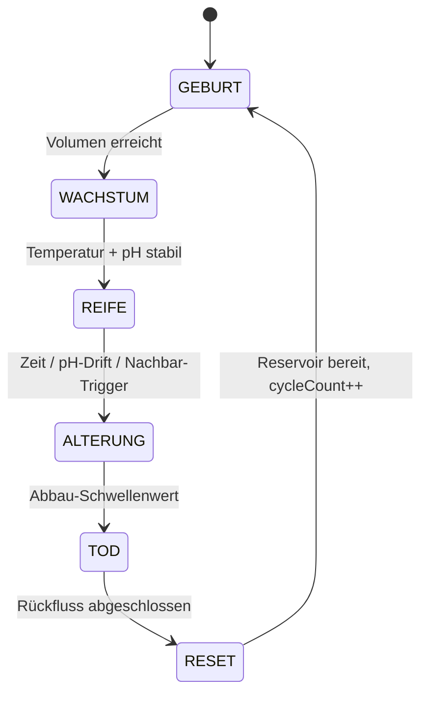

---
tags:
  - projekt
  - biologie
  - medienkunst
typ: konzept
bereich: projekt
status: in-progress
---

# Artificial Bacteria — Theoretisches Konzept

> Eine Maschine die sich nach biologischen Prinzipien verhält: Aufbau, Stabilität, Abbau, Tod, Wiedergeburt. Kein lebender Organismus — aber ein System das denselben Regeln folgt. Die Frage ist nicht ob es lebt, sondern was es bedeutet dass es so aussieht als ob.

**Verwandte Themen:** [[__cosmicbrain__]] | [[anabolismus_katabolismus]] | [[quorum_sensing]] | [[biosemiotik]] | [[semipermeable_membran]] | [[turing_land_duchamp_land]] | [[pataphysik]] | [[__sandbox__]] | [[artificial_bacteria_technik]]

---

## Ausgangspunkt: Game of Life

Conway's Game of Life (1970) ist kein Spiel — es ist ein zellulärer Automat. Ein Raster aus Zellen, jede entweder lebendig oder tot. Keine zentrale Steuerung. Nur drei Regeln:

1. Lebende Zelle mit 2–3 Nachbarn → **überlebt**
2. Lebende Zelle mit < 2 oder > 3 Nachbarn → **stirbt**
3. Tote Zelle mit genau 3 Nachbarn → **wird lebendig**

Daraus entstehen stabile Strukturen, Oszillatoren, wandernde Muster — [[emergenz|emergente Komplexität]] aus minimalen Regeln. Das System ist Turing-vollständig. Kein Element kennt das Gesamtbild. Jede Zelle reagiert nur auf ihre unmittelbaren Nachbarn. Das Muster entsteht trotzdem — oder vielleicht: deswegen.

**Die entscheidende Frage:** Was passiert wenn die Regeln nicht binär (lebendig/tot) sondern metabolisch sind?

---

## Der metabolische Automat

Game of Life hat zwei Zustände. Biologische Zellen haben mindestens fünf:

| Biologischer Zustand | Automat-Zustand | Physisches Äquivalent |
|---|---|---|
| Wachstum | ANABOLISMUS | Sol fließt ein, Gel baut auf |
| Stabil | REIFE | Gel fest, pH stabil |
| Stress | ALTERUNG | pH driftet, Enzyme aktiv |
| Abbau | KATABOLISMUS | Gel löst sich auf |
| Tod | NULL | Behälter leer |

Das ist kein Game of Life mehr — das ist ein **metabolischer Automat**. [[quorum_sensing|Quorum Sensing]] als zelluläre Automatik: Nachbarschaftsregeln ohne Kabel, ohne Protokoll. Nur Chemie.

> Wenn 3 oder mehr Nachbar-Einheiten im Katabolismus sind → Einheit beschleunigt eigenen Abbau.
> Wenn alle Nachbarn in Reife → Einheit verlängert Stasis.
> Wenn Einheit isoliert → stirbt schneller.

---

## Das Kernprinzip: Geschlossener Metabolismus

Das System hat keinen Anfang und kein Ende — nur Phasen. Dasselbe Material durchläuft permanent Aufbau, Stabilität und Auflösung. Die Skulptur *ist* der Prozess, nicht das Objekt.

**Was der Kreislauf bedeutet:** Kein Material geht verloren — es transformiert. Gelatine-Sol wird Gel (Anabolismus), Gel wird wieder Sol (Katabolismus), Sol wird erneut erhitzt und neu eingespeist. Das System *isst sich selbst* um fortzubestehen — [[autophagie|Autophagie]] als Designprinzip.

---

## Gelatine als metabolisches Material

Gelatine ist denaturiertes Kollagen — aufgebrochene Proteinstrukturen die in Wasser ein dreidimensionales Netzwerk bilden. Bei ~20–30°C fest (Gel), bei >35°C flüssig (Sol). Der Sol-Gel-Übergang ist der physische Ausdruck von Anabolismus und Katabolismus.

**Abbau-Mechanismen — drei Wege zum Tod:**

| Mechanismus | Mittel | Geschwindigkeit | Ästhetik |
|---|---|---|---|
| Enzymatisch | Papain, Bromelain, Kiwisaft (frisch) | 6–24h | langsam, von außen erodierend |
| Sauer | Zitronensäure, Milchsäure | 1–6h | gleichmäßiger Kollaps, Farbwechsel |
| Thermisch | Heizelement > 35°C | Minuten | reversibel, kein Chemikalieneinsatz |

**Farbe als Lebenszustand — Anthocyan (Rotkohl-Extrakt):**

| Phase | pH | Farbe |
|---|---|---|
| Geburt / Wachstum | 7 | violett |
| Reife | 6.5–7.5 | lila |
| Alterung | 5–6 | rot-violett |
| Tod | < 4 | rot |
| Regeneration | > 8 | grün/blau |

Kein Aktor nötig — die Farbe ändert sich autonom mit dem Stoffwechselzustand.

---

## Drei Ebenen des Systems

**Ebene 1 — Die einzelne Einheit**
Eine Zelle. Sie hat Metabolismus, Lebenszyklus, Zustände. Reservoir (Sol, 65°C) → Zell-Körper (Gel, ~20°C) → Lysosom (Abbaulösung) → zurück. Demonstration von Metabolismus.

**Ebene 2 — Das Netzwerk**
Mehrere Einheiten teilen ein gemeinsames Medium im Reservoir. Abbauprodukte einer Einheit beeinflussen die Abbaurate der anderen über pH-Drift und Enzymkonzentration. Kein zentraler Controller. Das ist Quorum Sensing als physisches System.

**Ebene 3 — Emergenz**
Welche Muster entstehen wenn 5–20 Einheiten nach metabolischen Regeln interagieren? Nicht vorhersagbar. Manche Cluster stabilisieren sich. Manche erzeugen Katabolismus-Wellen. Manche Einheiten werden durch Nachbarn am Leben gehalten.

```mermaid
graph TD
    A[Einheit: Reife] -->|Autoinduktor-Signal| B[Einheit: Wachstum]
    B -->|Abbauprodukte ins Medium| C[Einheit: Katabolismus]
    C -->|pH-Abfall im Medium| A
    C -->|pH-Abfall im Medium| D[Einheit: Alterung beschleunigt]
    D --> E[Einheit: Tod]
    E -->|freigesetzte Masse| B
    style C fill:#3a1a1a,stroke:#a44
    style A fill:#1a3a1a,stroke:#4a8
    style B fill:#1a2a3a,stroke:#48a
    style D fill:#2a2a1a,stroke:#aa4
    style E fill:#1a1a1a,stroke:#555
```

---

## Generatives Gedächtnis — das System erbt

Das Reservoir-Material nach dem Abbau ist nicht neutral. Es trägt Geschichte:

- **pH-Rückstände** → nächstes Gel beginnt leicht sauer → anderer Farbton ab Generation 1
- **Enzymrückstände** → nächstes Gel beginnt direkt schwach abzubauen → kürzere Lebensdauer
- **Pigmentakkumulation** → jede Generation dunkler
- **Kalk-Rückstände** (bei Mineralwasser) → kristalline Einschlüsse wachsen mit jeder Generation

Das System **erbt von seinen Vorgängern**. Ohne Neutralisation verändert es sich unkontrolliert — das ist gewollt.

**Konzentration als Lebensphase:**

| Generation | Konzentration | Konsistenz |
|---|---|---|
| 1–3 | 2–3% | weich, formbar — Jugend |
| 4–7 | 5–7% | mittelfest — Reife |
| 8–12 | 10% | fest, spröde — Alter |
| 13+ | zurück zu 2% | Neugeburt |

Das Alter beschleunigt den Tod. Die Neugeburt ist wieder jung.

---

## Theoretische Einbettung

**[[turing_land_duchamp_land|Turing Land]]:** Wenn das System sich wie Metabolismus verhält, ist es Metabolismus. Die Ausgabe zählt, nicht das Substrat.

**[[turing_land_duchamp_land|Duchamp Land]]:** Es ist erst Metabolismus wenn wir es so nennen und in diesen Kontext stellen. Das Gel im Behälter ist erst Lebenszyklus wenn die Rahmung ihn so benennt.

**[[pataphysik|Pataphysik]]:** Das System löst ein imaginäres Problem — es *simuliert* Leben ohne den Anspruch zu stellen, lebendig zu sein. Das Absurde als Methode.

**[[biosemiotik|Biosemiotik]]:** Die Maschine interpretiert keine Zeichen. Aber sie *produziert* Zeichen — Farbveränderungen, Konsistenzwechsel, Abbaumuster — die ein Betrachter als Lebenszustände lesen kann. Der Betrachter vollzieht die Semiose, nicht die Maschine.

**[[semipermeable_membran|Semipermeable Membran]]:** Der Zell-Körper hat eine Grenze — aber sie kommuniziert nicht. Sie trennt nur. Das ist der fundamentale Unterschied zu biologischen Zellen. Die Frage ist ob dieser Unterschied relevant ist — oder ob die Funktion ausreicht.

> Die Maschine ist nicht lebendig. Aber sie verhält sich nach denselben Prinzipien wie das Lebendige. Was sagt das über Leben? Was sagt das über Maschinen?

---

## Technische Umsetzung

→ [[artificial_bacteria_technik]]

---

## Summary (EN)

Artificial Bacteria is a closed metabolic system using gelatin as its material substrate. Sol becomes gel (anabolism), gel is enzymatically or acidically dissolved back into sol (catabolism / autophagy), sol is reheated and reintroduced — a closed loop. Multiple units networked in a shared medium behave like a metabolic cellular automaton: Conway's Game of Life with five states instead of two, and chemical signalling instead of binary rules. The system inherits from previous generations through residual pH, enzymes, and pigments. It is not alive. But it follows the same principles as living systems — and asks what that means.
