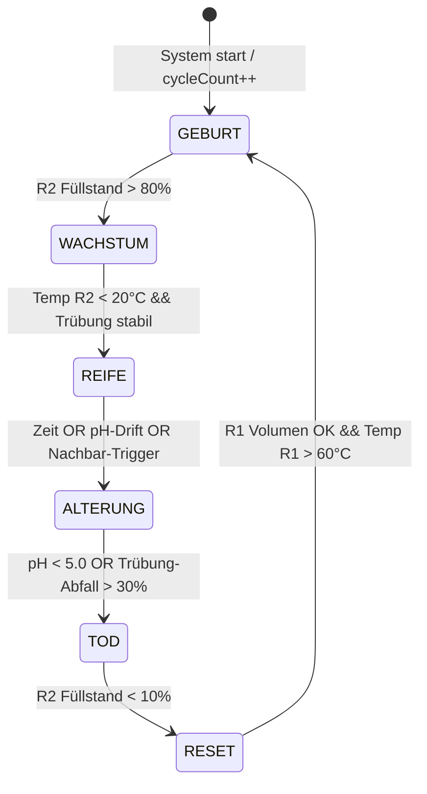

---
tags:
  - projekt
  - biologie
  - technik
typ: technik
bereich: projekt
status: in-progress
---

# Artificial Bacteria — Technische Umsetzung

> Hardware, Architektur, Zustandsmaschine, Chemie. Wie das [[artificial_bacteria_konzept|theoretische Konzept]] physisch realisiert wird.

**Querverweise:** [[artificial_bacteria_konzept]] | [[anabolismus_katabolismus]] | [[quorum_sensing]] | [[kalziumkarbonat]] | [[__cosmicbrain__]]

---

## Systemarchitektur — Drei-Behälter-Prinzip

Jede Einheit besteht aus drei Behältern die über Pumpen und Ventile verbunden sind:

```
┌──────────────────────────────────────────────────┐
│                  EINZELNE EINHEIT                │
│                                                  │
│  ┌─────────┐    ┌─────────────┐    ┌──────────┐  │
│  │  R1     │───▶│    R2       │───▶│   R3     │  │
│  │Reservoir│    │ Zell-Körper │    │ Lysosom  │  │
│  │(Sol)    │    │(Gel-Körper) │    │(Abbau)   │  │
│  │65°C     │    │15–25°C      │    │pH<4      │  │
│  │         │◀───│             │    │          │  │
│  └─────────┘    └─────────────┘    └────┬─────┘  │
│    Heizer         Peltier Kühler        │        │
│    DS18B20        DS18B20          Rückfluss     │
│    Füllstand      pH + Trübung     nach R1       │
│                   Kamera                         │
└──────────────────────────────────────────────────┘
```

| Behälter | Funktion | Material | Temperatur |
|---|---|---|---|
| **R1 — Reservoir** | Gelatine-Sol lagern + erhitzen | 2–10% Gelatine-Sol | 60–65°C (flüssig halten) |
| **R2 — Zell-Körper** | Gel aufbauen, Lebenszyklus zeigen | Gel nach Einpumpen + Kühlen | 10–22°C (fest halten) |
| **R3 — Lysosom** | Gel enzymatisch/sauer abbauen | Abbaupuffer + Enzym/Säure | Raumtemperatur |

**Fließrichtung:**
- GEBURT: R1 → R2 (Pumpe P1 aktiv, Sol fließt ein, Peltier kühlt)
- TOD: R2 → R3 (Pumpe P2 aktiv, Abbaulösung fließt in Zell-Körper oder Gel löst sich)
- RESET: R3 → R1 (Pumpe P3 aktiv, aufgelöste Masse zurück — das Gedächtnis überlebt)

---

## Zustandsmaschine



**Zustand → Aktionen:**

| Zustand | Aktoren | Sensoren | Farbe (Anthocyan) |
|---|---|---|---|
| GEBURT | P1 ein, Peltier ein, Heizer R1 | Füllstand HC-SR04, Temp DS18B20 | violett |
| WACHSTUM | P1 aus, Peltier hält Temp | Temp, Trübung | lila |
| REIFE | Alle Pumpen aus, Peltier läuft | pH, Temp, Kamera | lila-stabil |
| ALTERUNG | Enzym-Dosierung (V_enzym) | pH-Abfall, Trübungs-Abfall | rot-violett |
| TOD | P2 ein (Abbau-Rückfluss) | Füllstand R2 | rot |
| RESET | P3 ein (Rückfluss R3→R1) | Füllstand, Temp R1 | — |

---

## Hardware — Stückliste

| Komponente | Modell | Funktion | ~ Kosten |
|---|---|---|---|
| **Mikrocontroller** | ESP32 (38-pin) | Steuerung, WiFi, BLE | 4–6 € |
| **Peristaltikpumpen** | 12V DC, 40 ml/min | Flüssigkeitsförderung P1, P2, P3 | 8–12 € / Stk |
| **Magnetventile** | 12V Normalgeschlossen | Absperrung, Weichenstellung | 5–8 € / Stk |
| **pH-Sensor** | pH-4502C oder DFRobot SEN0161 | Metabolismus-Monitoring R2 | 10–15 € |
| **Trübungssensor** | DFRobot SEN0189 | Gel-/Sol-Erkennung | 8–12 € |
| **Temperatursensor** | DS18B20 (wasserdicht) | R1, R2, R3 je einer | 2–3 € / Stk |
| **Peltier-Element** | TEC1-12706 (12V, 6A) | R2 kühlen für Gel-Bildung | 4–6 € |
| **Kühlkörper + Lüfter** | 40×40 mm Aluminium | Peltier heiße Seite abführen | 3–5 € |
| **Heizelement** | 12V Silikon-Heizmatte | R1 auf 65°C halten | 5–8 € |
| **Ultraschall-Abstand** | HC-SR04 | Füllstand in R1, R2 messen | 2–3 € |
| **Kamera** | ESP32-CAM | Visuelle Dokumentation | 5–10 € |
| **Echtzeituhr** | DS3231 | Zeitstempel, zirkadiane Rhythmen | 3–5 € |
| **SD-Karte + Modul** | MicroSD SPI | Zyklusprotokolle speichern | 3–5 € |
| **Relais-Board** | 4-Kanal 5V | Pumpen + Heizer schalten | 3–5 € |
| **Mosfet-Treiber** | IRLZ44N oder IRF520 | Peltier PWM-Steuerung | 1–2 € |
| **Netzteil** | 12V 5A | Pumpen + Peltier + Heizer | 8–12 € |
| **Behälter** | Klarglas / PETG-Druck | R1, R2, R3 | 10–20 € |

**Geschätzte Kosten pro Einheit: 90–140 €** (ohne Gehäuse, ohne Schlauchsystem)

---

## Elektrisches Schema (vereinfacht)

```
ESP32 GPIO → Relais-Board → P1 Pumpe (12V)
                          → P2 Pumpe (12V)
                          → P3 Pumpe (12V)
                          → Heizer R1 (12V)
           → MOSFET PWM → Peltier TEC1-12706

ESP32 ADC ← pH-Sensor (analog, 0-3.3V)
          ← Trübungssensor (analog)

ESP32 1-Wire ← DS18B20 ×3 (alle auf einem Bus)

ESP32 Trig/Echo ← HC-SR04 ×2

ESP32 I2C ← DS3231 RTC

ESP32 SPI ← SD-Karte

ESP32 ← ESP32-CAM (UART oder eigener Core)
```

**Wichtig:** pH-Sensor braucht Kalibrierung mit pH 4.0 + pH 7.0 Pufferlösung. DS18B20 braucht 4.7kΩ Pull-up auf 3.3V.

---

## Chemie — Trägermedium und Abbaumechanismen

### Basis-Gelatine-Sol (R1)

| Konzentration | Konsistenz nach Kühlung | Lebenszyklus-Phase |
|---|---|---|
| 2–3% | sehr weich, wackelig | Generation 1–3 (Jugend) |
| 5–7% | mittelfest, flexibel | Generation 4–7 (Reife) |
| 10%+ | fest, leicht spröde | Generation 8–12 (Alter) |

**Additiv:** Anthocyan (Rotkohl-Extrakt, 2–5 ml / 200 ml Sol) als integrierten pH-Indikator.

### pH → Farbkarte (Anthocyan)

| pH | Farbe | Zustandsbedeutung |
|---|---|---|
| > 8 | blau-grün | überneutral, Regeneration |
| 7.0–7.5 | violett | neutral, Geburt |
| 6.0–7.0 | lila-rosa | leicht sauer, Reife |
| 5.0–6.0 | rot-violett | Alterung aktiv |
| < 4.5 | rot | Tod |

**Hinweis:** Anthocyan verblasst bei UV-Licht. Für Außeninstallationen → thermochrome Pigmente kombinieren (Umschlagstemperatur 27°C passend für Sol/Gel-Übergang).

### Abbau-Protokolle (R3 / Alterungs-Dosierung)

**Option A — Enzymatisch (langsam, organisch wirkend)**
- Frischer Kiwisaft (Actinidin) oder Ananassaft (Bromelain): 10–20 ml pro 200 ml Puffer
- Wirkzeit: 6–24h bei Raumtemperatur
- pH bleibt ~ neutral → Farbe verändert sich wenig, Textur kollabiert zuerst
- Ästhetik: von innen zersetzt, langsamer Kollaps

**Option B — Sauer (schnell, dramatischer Farbwechsel)**
- Zitronensäure-Lösung (5–10%) oder Milchsäure
- Wirkzeit: 1–6h
- pH fällt deutlich → Anthocyan wechselt rot → starker visueller Effekt
- Ästhetik: schnelle Transformation, Farbe zeigt Fortschritt

**Option C — Thermisch (reversibel, keine Chemikalien)**
- Heizelement in R2 über 35°C → Sol-Bildung
- Kein pH-Effekt, keine Enzym-Akkumulation im Folge-Zyklus
- Ästhetik: sauberster Kreislauf, aber weniger sichtbarer Abbauprozess

**Empfehlung:** Option A + B kombiniert: enzymatische Vorbehandlung → saurer Beschleuniger → dramatischer Endkollaps.

### Trägermedium-Variationen

| Medium | Besonderheit | Effekt |
|---|---|---|
| Destilliertes Wasser | sauberste Zyklen, kein Rückstand | volle Kontrolle über pH |
| Mineralwasser (kalkhaltig) | [[kalziumkarbonat|CaCO3]]-Ausfällungen | kristalline Einschlüsse wachsen mit jeder Generation |
| Leicht gesalzen (0.9%) | nähert sich biologisch | Evaporation sichtbar, Salzkristalle |
| Mischkultur | unkontrolliert, risikobehaftet | echte biologische Übernahme möglich |

---

## Generatives Gedächtnis — Rückstandsakkumulation

Nach jedem Zyklus fließt die Abbaulösung aus R3 zurück in R1 (RESET-Phase). Das neue Sol trägt den Rückstand des Alten:

| Rückstandstyp | Herkunft | Effekt in nächster Generation |
|---|---|---|
| pH-Drift | Säure-Abbau | nächstes Gel startet leicht sauer, Farbe dunkler |
| Enzymrückstand | enzymatischer Abbau | nächstes Gel beginnt direkten Abbau früher |
| Anthocyan-Pigment | Akkumulation | jede Generation dunkler gefärbt |
| Kalk-Rückstand | Mineralwasser-Träger | kristalline Einschlüsse pro Generation mehr |

**Neutralisations-Option (wenn Rückset gewünscht):** Natriumbicarbonat (Backpulver) zur pH-Neutralisation nach TOD-Phase, vor RESET → System beginnt neutral aber ohne Kristalle zu verlieren.

---

## Netzwerk-Modus — Quorum Sensing physisch

Mehrere Einheiten teilen einen gemeinsamen Reservoir (R1 global). Wenn eine Einheit TOD-Phase erreicht, fließen Abbauprodukte ins geteilte Medium:

```
Einheit A (Reife) ──┐
Einheit B (Wachstum)──┤── [Gemeinsames Reservoir] ──── alle saugen Sol ab
Einheit C (TOD) ──┘   (pH sinkt, Enzymkonzentration steigt)
```

**Emergente Regeln (analog [[zellulaere_automaten|Game of Life]]):**
- Wenn pH im gemeinsamen Reservoir < 6.0 → alle Einheiten verkürzen Reife-Dauer
- Wenn > 50% der Einheiten in REIFE → Reservoir stabilisiert sich (Pufferung)
- Wenn isolierte Einheit (Netz-Trennung) → stirbt schneller ohne Stützeffekt

**ESP32-Kommunikation zwischen Einheiten:** ESP-NOW (Peer-to-Peer, kein Router nötig) für Zustandsmeldungen. Broadcast-Nachrichten: `{unit_id, state, pH, turbidity}` alle 30s.

---

## Protokoll-Schema (Pseudocode)

```cpp
// ESP32 Hauptloop — vereinfacht
enum State { GEBURT, WACHSTUM, REIFE, ALTERUNG, TOD, RESET };
State current = GEBURT;
int cycleCount = nvs_read("cycleCount");  // persistiert über Neustarts

void loop() {
  float pH = readPH();
  float temp_R2 = readTemp(SENSOR_R2);
  float turbidity = readTurbidity();
  float level_R2 = readLevel(ULTRASONIC_R2);

  switch(current) {
    case GEBURT:
      pump_on(P1);
      peltier_on();
      if (level_R2 > 0.8) { pump_off(P1); transition(WACHSTUM); }
      break;

    case WACHSTUM:
      if (temp_R2 < 20.0 && turbidity_stable()) transition(REIFE);
      break;

    case REIFE:
      // Alterungs-Trigger: Zeit ODER pH-Drift ODER Nachbar-Signal
      if (millis() - reife_start > REIFE_DAUER) transition(ALTERUNG);
      if (pH < 6.5) transition(ALTERUNG);
      if (neighbor_in_katabolismus_count >= 3) transition(ALTERUNG);
      break;

    case ALTERUNG:
      valve_open(V_ENZYM);  // Enzym-Dosierung in R2
      if (pH < 5.0 || turbidity < turbidity_baseline * 0.7) transition(TOD);
      break;

    case TOD:
      pump_on(P2);  // Abbau-Rückfluss R2 → R3
      if (level_R2 < 0.1) { pump_off(P2); transition(RESET); }
      break;

    case RESET:
      pump_on(P3);  // R3 → R1
      cycleCount++;
      nvs_write("cycleCount", cycleCount);
      updateConcentration(cycleCount);  // anpassen: 2% → 10% → 2%
      if (level_R3 < 0.1 && temp_R1 > 60.0) transition(GEBURT);
      break;
  }
  broadcast_state(current, pH, turbidity);  // ESP-NOW Netzwerk
  log_to_sd(current, pH, turbidity, temp_R2, cycleCount);
}
```

---

## Kamera-Integration (ESP32-CAM)

- **Funktion:** Timelapse des Zell-Körpers (R2) — Gel-Bildung, Farbverläufe, Abbau
- **Trigger:** Foto bei jedem Zustandsübergang + alle 10 min in REIFE
- **Speicher:** SD-Karte, Ordnerstruktur `/cycle_[N]/[state]_[timestamp].jpg`
- **Optional:** HTTP-Stream über WiFi für Live-Monitoring oder Projektion

---

## Gehäuse und Designoptionen

**Option A — Sichtbar scientific:**
Klarglas-Behälter in einem Metallgestell (Laborästhetik). Alle Schläuche, Pumpen, Elektronik sichtbar. Kein Versteck — das System zeigt seine eigene Maschinennatur.

**Option B — Organisch verborgen:**
3D-gedruckte oder keramische Außenhülle erinnert an biologische Form (Zelle, Ei, Organ). Technik innen, nur Materialzustände sichtbar. Maschine tarnt sich als Organismus.

**Option C — Minimal:**
Nur der Zell-Körper R2 ist sichtbar — erhöhter Glaszylinder. R1 und R3 unsichtbar dahinter. Nur das "Leben" wird gezeigt, nicht der Kreislauf.

---

## Theoretisches Konzept

→ [[artificial_bacteria_konzept]]
