---
tags:
  - biologie
  - metabolismus
  - medienkunst
typ: theorie
bereich: biologie
---

# Anabolismus & Katabolismus — Aufbau und Zerfall als gleichwertige Zustände

> Zwei Seiten des Stoffwechsels: Anabolismus baut auf, Katabolismus baut ab. In der Biologie notwendige Gegensätze. In der Kunst: Entstehung und Zerfall als gleichberechtigte ästhetische Prozesse — keiner ist Endpunkt.

**Verwandte Themen:** [[__cosmicbrain__]] | [[kalziumkarbonat]] | [[semipermeable_membran]] | [[quorum_sensing]] | [[artificial_bacteria_konzept]] | [[artificial_bacteria_technik]] | [[__sandbox__]]

---

## Metabolismus — der übergeordnete Rahmen

**Metabolismus** (Stoffwechsel) ist die Gesamtheit aller chemischen Reaktionen in einem lebenden Organismus. Er ist die fundamentale Eigenschaft des Lebens: ohne Stoffwechsel kein Leben.

Der Metabolismus gliedert sich in zwei gegensätzliche, aber untrennbar verbundene Prozesse:

| | Anabolismus | Katabolismus |
|---|---|---|
| Richtung | Aufbau | Abbau |
| Energie | verbrauchend (ATP-Nutzung) | freisetzend (ATP-Produktion) |
| Produkt | komplexe Moleküle | einfache Bausteine + Energie |
| Beispiel | Proteinsynthese, DNA-Replikation | Verdauung, Zellatmung |

Entscheidend: Beide Prozesse laufen **gleichzeitig** und **in Balance**. Der Organismus ist kein statisches Gebäude sondern ein dauerhafter Prozess des Umbaus. Jede Zelle erneuert sich — über Monate bis Jahre wird nahezu jedes Molekül im Körper ersetzt.

---

## Anabolismus

Synthese komplexer Moleküle aus einfachen Bausteinen. Energie-verbrauchend.

- Proteinsynthese aus Aminosäuren
- DNA-Replikation und Zellwachstum
- Knochenmineralisierung (→ [[kalziumkarbonat]])
- Glykogensynthese als Energiespeicher

Anabolismus ist sichtbar als Wachstum, Heilung, Aufbau. Die produzierende Seite des Lebens.

---

## Katabolismus

Abbau komplexer Moleküle in einfache Bausteine. Energie-freisetzend.

- Verdauung: Nahrung → Aminosäuren, Zucker, Fettsäuren
- Zellatmung: Glukose → CO₂ + H₂O + ATP
- **[[autophagie|Autophagie]]** — Selbstverdauung: Zellen bauen beschädigte Organellen und Proteine ab und recyceln die Bausteine. Kein Versagen, sondern Wartung und Reinigung des Systems.
- Apoptose: programmierter Zelltod als Abbau im Dienst des Organismus

```mermaid
graph TD
    M[Metabolismus — Stoffwechsel]
    M --> A[Anabolismus]
    M --> K[Katabolismus]
    A -->|Energie verbrauchen| B[Komplexe Strukturen\nProteine · DNA · Knochen]
    K -->|Energie freisetzen| C[Einfache Bausteine\nAminosäuren · ATP · CO₂]
    B -->|Katabolismus| C
    C -->|Anabolismus| B
    K --> AU[Autophagie — intern\nZellreparatur · Recycling]
    style M fill:#2a2a2a,stroke:#888
    style A fill:#1a3a1a,stroke:#4a8
    style K fill:#3a1a1a,stroke:#a44
    style AU fill:#1a1a3a,stroke:#44f
```

---

## Medienkünstlerische Perspektive

Die industrielle Ästhetik privilegiert den Aufbau: Produktion, Wachstum, Ausgabe. Katabolismus wird als Fehler, Zerfall, Verlust gelesen. Aber in biologischen Systemen ist der Abbau ebenso notwendig und strukturiert wie der Aufbau — Autophagie ist kein Versagen, sondern Wartung.

Das Metabolismus-Modell als Kritik an digitalen Systemen: Software wächst, akkumuliert, vergrößert sich — aber vergisst, recycelt, verkleinert sich nie. Kein Katabolismus. Kein Vergessen. Das ist biologisch unmöglich und ästhetisch beschränkend.

**Für die Skulptur:** Materialien die wachsen und sich gleichzeitig auflösen. Bakterien die [[kalziumkarbonat|Kalziumkarbonat]] aufbauen während andere Organismen es abbauen. Zeit als sichtbarer Parameter.

**Für generative Systeme:** Algorithmen die nicht nur wachsen sondern auch vergessen, abbauen, recyceln. Das System, das sich selbst isst. Autophagie als Designprinzip.

Verbindung zu [[__sandbox__#Kunstprojekte & Ideen|Monumentale Skulpturen — Recycling Ancient Art]]: historische Skulpturen nachbilden, zersetzen, neu formen — Anabolismus und Katabolismus als skulpturaler Prozess.

---

## Summary (EN)

Metabolism is the totality of all chemical reactions sustaining life. Anabolism (building up) and catabolism (breaking down) are its two inseparable sides, running simultaneously and in balance. The organism is not a static structure but a continuous process of rebuilding — every molecule is eventually replaced. In art: creation and decay as equally valid aesthetic states. Autophagy (self-digestion for cell repair) as a model for systems that maintain themselves through controlled destruction. Systems that only grow are biologically impossible — and aesthetically limiting.
