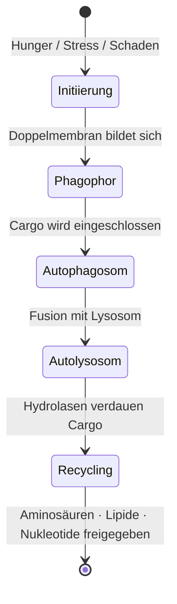

---
tags:
  - biologie
  - medienkunst
typ: theorie
bereich: biologie
---

# Autophagie — Das System isst sich selbst

> Griechisch: *autos* (selbst) + *phagein* (essen). Zelleigener Abbau- und Recyclingsystem: beschädigte Organellen, fehlgefaltete Proteine, zelluläre Abfälle werden eingeschlossen, in Lysosomen verdaut, die Bausteine wiederverwendet. Kein Versagen — zelluläre Wartung, Qualitätskontrolle, Selbsterhaltung durch Selbstauflösung.

**Verwandte Themen:** [[anabolismus_katabolismus]] | [[artificial_bacteria_konzept]] | [[bakterielle_adaptation|Endosporen]] | [[biosemiotik]] | [[__cosmicbrain__]]

---

## Mechanismus

### Die drei Hauptwege

| Weg | Mechanismus | Ziel |
|---|---|---|
| **Makroautophagie** | Doppelmembran (Autophagosom) umschließt Cargo | große Strukturen: Organellen, Aggregate |
| **Mikroautophagie** | Lysosom stülpt sich direkt ein | kleine zytosolische Bestandteile |
| **Chaperonvermittelte Autophagie (CMA)** | Translokasetransport durch Membran | spezifische Proteine mit KFERQ-Motiv |

Die Makroautophagie ist die relevanteste:

### Schlüsselproteine — ATG-Familie

Die Autophagie-Maschinerie besteht aus ~40 **ATG-Genen** (Autophagy-Related Genes), ursprünglich in Hefe entdeckt. **Yoshinori Ohsumi** erhielt 2016 den Nobelpreis für Physiologie für ihre Aufklärung.

Wichtigste Regulatoren:
- **mTOR** — Haupthemmer der Autophagie: wenn Nährstoffe vorhanden → mTOR aktiv → Autophagie gehemmt
- **AMPK** — Aktiviert Autophagie bei Energiemangel
- **Beclin-1** — Initiierungsfaktor, onkosuppressiv
- **LC3** — Markiert und verankert Cargo im Autophagosom

---

## Selektive Autophagie

Autophagie ist nicht blind. Selektive Formen erkennen spezifischen Cargo durch **Autophagie-Rezeptoren** (p62/SQSTM1, NDP52):

| Form | Ziel |
|---|---|
| **Mitophagie** | Beschädigte Mitochondrien |
| **ER-Phagie** | Endoplasmatisches Retikulum-Fragmente |
| **Xenophagie** | Intrazelluläre Pathogene (Bakterien, Viren) |
| **Ribophagie** | Überflüssige Ribosomen |
| **Lipophagie** | Lipidtröpfchen |

Das System kennt seine eigenen Defekte und zielt auf sie.

---

## Physiologische Relevanz

**Positiv (Erhaltung):**
- Nährstoffrecycling bei Hunger
- Qualitätskontrolle: Proteindegradation verhindert toxische Aggregate
- Immunabwehr durch Xenophagie
- Entwicklung: Organ-Umbau, Differenzierung

**Dysregulation (Pathologie):**
- **Zu wenig Autophagie:** Akkumulation von Proteosaggregaten → Alzheimer, Parkinson, Huntington
- **Zu viel Autophagie:** autophagischer Zelltod bei extremem Stress
- **Krebs:** Autophagie kann je nach Kontext tumorsuppressiv oder tumorbegünstigend sein

---

## Medienkünstlerische Perspektive

Autophagie ist das biologische Argument für Wartung als kreative Praxis. Das System löscht nicht — es recycelt. Jeder Abbauvorgang liefert Bausteine für Neues. Auflösung und Aufbau sind nicht sequenziell, sondern gleichzeitig.

Im Kontext von [[artificial_bacteria_konzept|Artificial Bacteria]]: das Prinzip des geschlossenen metabolischen Kreislaufs ist direkt autophagetisch — das System verdaut sich selbst um fortzubestehen. Kein Material geht verloren. Die Skulptur isst sich selbst.

**Systemkritik:** Digitale Systeme haben keine Autophagie. Keine selektive Selbstverdauung von beschädigtem Code, veralteten Daten, überflüssigen Prozessen. Sie akkumulieren. Legacy-Code ist das Gegenteil von Mitophagie.

---

## Summary (EN)

Autophagy is the cellular self-digestion system: damaged organelles and misfolded proteins are enclosed in double-membrane autophagosomes, fused with lysosomes, and broken down into reusable building blocks. 2016 Nobel Prize (Ohsumi). Three pathways (macro, micro, chaperone-mediated), regulated primarily by mTOR (suppressor) and AMPK (activator). Selective forms target specific cargo (mitophagy, xenophagy). In media art: the closed metabolic loop as artistic principle — the system eats itself to persist. The opposite of accumulation-without-forgetting that characterises digital systems.
