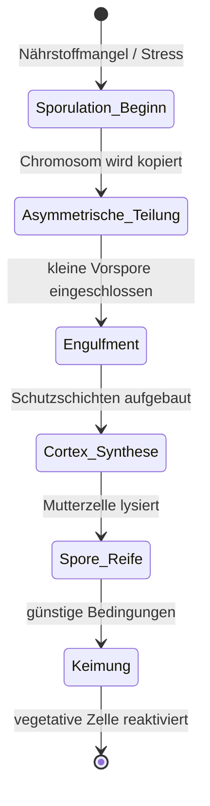

---
tags:
  - biologie
  - algorithmus
  - medienkunst
typ: theorie
bereich: biologie
---

# Bakterielle Adaptation — Endosporen & Horizontaler Gentransfer

> Wenn binäre Spaltung nicht reicht: Bakterien haben zwei radikale Alternativstrategien entwickelt. Endosporen frieren den Systemzustand ein — jahrtausendlange Pause bis zur Reaktivierung. Horizontaler Gentransfer verändert das Programm zur Laufzeit durch direkten Code-Austausch zwischen Individuen. Beide umgehen die Grenzen normaler Reproduktion.

**Verwandte Themen:** [[bakterielle_vermehrung]] | [[zellteilung]] | [[quorum_sensing]] | [[biosemiotik]] | [[artificial_bacteria_konzept]] | [[__cosmicbrain__]]

---

## Teil 1 — Endosporen: Eingefrorener Systemzustand

### Was ist eine Endospore?

Keine Fortpflanzungsform — eine **Überlebensform**. Bei extremem Nährstoffmangel, Austrocknung, UV-Strahlung oder thermischem Stress bilden bestimmte Bakterien (*Bacillus*, *Clostridium*, *Sporosarcina*) eine hochgradig resistente Ruhezelle innerhalb ihrer Hülle.

### Sporulation — der Prozess

**Schichten der Endospore:**
| Schicht | Funktion |
|---|---|
| Innere Membran | Schutz DNA |
| Cortex (Peptidoglykan) | Mechanische Resistenz |
| Coat (Proteinmantel) | Enzymatische Resistenz |
| Exosporium (bei manchen) | Äußerste Barriere |

### Resistenzprofil

| Stressor | Vegetative Zelle | Endospore |
|---|---|---|
| 100°C | stirbt sofort | überlebt bis 30 min |
| UV-Strahlung | stirbt in Minuten | überlebt Stunden |
| Austrocknung | stirbt | überlebt Jahrzehnte |
| Chemikalien (Desinfektionsmittel) | stirbt | oft resistent |
| Alter | Stunden bis Tage | **bis zu 250 Millionen Jahre** (Salzkristall-Sporen, kontrovers) |

### Keimung — Reaktivierung

Das Signal: Nährstoffe detektieren. Rezeptoren an der Sporenoberfläche binden Aminosäuren oder Ionen → Cortex wird abgebaut → Wasser strömt ein → Stoffwechsel reaktiviert. Innerhalb von Minuten bis Stunden: lebende Zelle aus der Ruhephase.

> **Algorithmus-Analogie:** Checkpoint-Save-File. Vollständiger Systemzustand eingefroren, später von exakt diesem Punkt fortgesetzt. Keine Prozessfortschritt verloren — nur Zeit überbrückt.

---

## Teil 2 — Horizontaler Gentransfer: Laufzeit-Code-Injektion

### Das Prinzip

Klassische Vererbung ist **vertikal**: Eltern → Kinder. Horizontaler Gentransfer (HGT) ist **lateral**: Individuum → Individuum, unabhängig von Abstammung. Ein Bakterium kann Eigenschaften erwerben ohne sich zu reproduzieren und ohne einen gemeinsamen Vorfahren mit dem Geber zu haben.

Das Ergebnis: Evolution ist kein Stammbaum — es ist ein Netzwerk.

```mermaid
graph LR
    A[Bakterium A\nAntibiotikaresistenz]
    B[Bakterium B\nkeine Resistenz]
    C[Bakterium B'\nResistenz erworben]
    A -->|HGT| B
    B --> C
    style C fill:#1a3a1a,stroke:#4a8
```

### Drei Wege des HGT

#### 1. Konjugation
Direkter Zell-zu-Zell-Kontakt über den **Pilus** — eine röhrenartige Verbindung. Plasmid-DNA wird übertragen. Der Pilus kann zwischen verschiedenen Bakterienarten funktionieren.

- Überträgt: Plasmide (extrachromosomale DNA-Ringe)
- Geschwindigkeit: Minuten bis Stunden
- **Hauptweg für Antibiotikaresistenz-Ausbreitung**

#### 2. Transformation
Zelle nimmt **nackte DNA** aus der Umgebung auf. DNA von toten Zellen liegt im Boden, Wasser, Biofilm. Manche Bakterien sind von Natur aus kompetent — können aktiv DNA aufnehmen. Andere werden durch Stress kompetent.

- Überträgt: beliebige freie DNA
- Grundlage genetischer Ingenieursarbeit (künstliche Transformation)
- Human entdeckt: Frederick Griffith, 1928 — Transformationsexperiment (*smooth*/*rough* Pneumococcus)

#### 3. Transduktion
**Bakteriophagen** (Viren die Bakterien infizieren) nehmen zufällig DNA des Wirts auf statt der eigenen. Beim nächsten Infektionszyklus übertragen sie diese DNA auf ein neues Bakterium.

- **Generalized Transduction:** beliebige DNA kann übertragen werden
- **Specialized Transduction:** nur DNA nahe dem Phagen-Integrationspunkt
- Langsam, spontan, unspezifisch — aber dauerhaft im Ökosystem aktiv

### Konsequenzen

| Eigenschaft | Implikation |
|---|---|
| Artenübergreifend möglich | Resistenzgene wandern zwischen Gattungen |
| Ohne Fortpflanzung | Evolution ohne Generationenwechsel |
| Netzwerk statt Stammbaum | Phylogenetik muss neu gedacht werden |
| Sehr schnell | Stunden bis Population vollständig resistent |

> **Medienkünstlerische Analogie:** Ein Programm das zur Laufzeit seinen eigenen Code von einem anderen Programm empfangen und integrieren kann. Nicht durch Update, nicht durch Neustart — durch direkte Übertragung zwischen laufenden Instanzen. Das Netzwerk lernt, nicht das Individuum.

---

## Gemeinsames Prinzip

Beide Strategien umgehen die Normalregel biologischen Lebens:

| | Normale Teilung | Endospore | HGT |
|---|---|---|---|
| Was wird übertragen? | Zustand an Nachfolger | Zustand in die Zeit | Code an Peer |
| Zeitachse | vorwärts | überbrückt | lateral |
| Voraussetzung | Ressourcen | Mangel | Kontakt oder tote Zellen |
| Algorithmus-Äquivalent | Rekursion | Checkpoint | Code-Injektion |

---

## Summary (EN)

Two radical bacterial strategies beyond binary fission: **endospores** are extreme dormancy structures that persist UV, heat, desiccation, and time (potentially millions of years) — a complete system-state freeze with later resumption. **Horizontal gene transfer (HGT)** moves genetic material between living individuals without reproduction: via conjugation (pilus, plasmid), transformation (uptake of environmental DNA), or transduction (phage-mediated accidental transfer). HGT means evolution is not a tree but a network. Antibiotic resistance spreads this way across species within hours.
