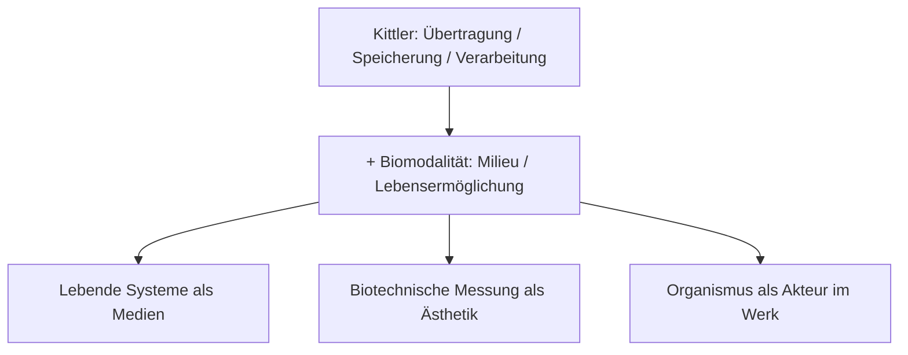

---
tags:
  - biologie
  - medientheorie
  - kittler
typ: theorie
bereich: biologie
---

# Biomodalität — Biologie als Medientheorie

> Erweiterung von Friedrich Kittlers Medientheorie um lebensermöglichende Milieus: biotechnische Instanzen der Messung, zweckentfremdet und ästhetisiert. Biologie als Mediensystem.

**Verwandte Themen:** [[__cosmicbrain__]] | [[biosemiotik]] | [[semipermeable_membran]] | [[quorum_sensing]] | [[__sandbox__]]

---

## Kittler erweitern

Friedrich Kittler definiert Medien über drei Funktionen: **Übertragung**, **Speicherung** und **Verarbeitung** von Information. Biomodalität fügt eine vierte Dimension hinzu: **Milieu** — die Bedingung des Lebendigen.

Lebende Systeme sind nicht nur Kanäle oder Speicher. Sie sind Milieus: sie erzeugen die Bedingungen, unter denen Leben stattfinden kann. Eine Zellmembran ist kein passiver Filter — sie ist ein aktives Kommunikationsmedium, das selektiv öffnet, schließt und moduliert.

---

## Biotechnische Instanzen der Messung

Wenn biologische Messsysteme — Sensoren, Biosensoren, fEMG, Hautleitfähigkeit — aus ihrem medizinischen Kontext herausgelöst und ästhetisiert werden, werden sie zu Biomedien. Die Messung des Lebendigen wird zum Ausdrucksmittel.

**Beispiele:**
- Gesichts-Elektromyografie als Instrument → ästhetische Apparatur
- Herzratenvariabilität als Datenquelle → Kompositionsprinzip
- Quorum Sensing als Kommunikationsprotokoll → Ausstellungsstruktur

---

## Medienkünstlerische Perspektive

Biomodalität erlaubt, über die klassische Mensch-Maschine-Interaktion hinauszugehen. Nicht nur der Mensch bedient die Maschine — lebende Systeme (Bakterien, Pilze, Pflanzen) werden zu Akteuren im Werk. Das Milieu ist nicht Hintergrund, sondern Medium.

Verbindung zu [[__cosmicbrain__#B|Biosemiotik]]: Wenn Biologie Medium ist, arbeitet Kunst mit Bedeutung — nicht nur mit Signal.

---

## Referenzen

- Friedrich Kittler — *Grammophon Film Typewriter* → [[literatur]]
- Jens Hauser — *Biotechnologie als Medialität* → [[literatur]]
- → [[__sandbox__#Medienkunst & Theorie]]

---

## Summary (EN)

Biomodality extends Kittler's theory of media (transmission, storage, processing) by adding a fourth dimension: milieu — the life-enabling condition. Biotechnical measurement devices, repurposed and aestheticised, become biomedial instruments. Living systems are not just subjects of art but active media. The organism is a medium.
