---
tags:
  - biologie
  - material
  - chemie
typ: theorie
bereich: biologie
---

# Kalziumkarbonat (CaCO₃) — Biologisch produziertes Material

> Chemische Verbindung die von Bakterien, Korallen und Muscheln biologisch produziert wird — mineralisierte Strukturen entstehen aus lebenden Prozessen. Material das von Leben gebaut wird, nicht von Maschinen.

**Verwandte Themen:** [[__cosmicbrain__]] | [[anabolismus_katabolismus]] | [[quorum_sensing]] | [[artificial_bacteria_technik]] | [[__sandbox__]]

---

## Biologie

CaCO₃ ist eine der häufigsten anorganischen Verbindungen in der Biosphäre — trotzdem primär biologischen Ursprungs:

- **Korallen** — bauen Kalziumkarbonat-Skelette: das Riff als kollektive biologische Architektur
- **Muscheln & Schnecken** — Schalen sind CaCO₃-Strukturen mit organischer Matrix
- **Coccolithophoren** — einzellige Algen bilden mikroskopische CaCO₃-Platten
- **MICP** (Microbially Induced Calcite Precipitation) — Bakterien produzieren CaCO₃ durch enzymatische Prozesse — genutzt in der Bioarchitektur

---

## Biofabrikation als Kunstperspektive

CaCO₃ ist ein Paradebeispiel für **Biofabrikation**: Material das nicht hergestellt, sondern gewachsen wird. Gegenmodell zur industriellen Fertigung.

In der Kunst:
- Bakterien die Mineralien produzieren und damit Skulpturen *wachsen*
- Biofilm-Architekturen die sich über Monate formen
- Material dessen Geschichte sichtbar ist — nicht Fabrik, sondern Organismus

Verbindung zu [[__cosmicbrain__#A|Anabolismus]]: Kalziumkarbonat-Produktion ist ein rein anabolischer Prozess — das Lebewesen investiert Energie um Struktur zu bauen.

Verbindung zu [[petrochemie|Petrochemie]]: Kontrast — fossile Materialien als geronnene biologische Zeit vs. lebend produziertes Material in Echtzeit.

```mermaid
graph TD
    B[Bakterium / Koralle / Muschel]
    B -->|enzymatische Prozesse| C[Ca²⁺ + CO₃²⁻]
    C --> D[CaCO₃ — Kalzit / Aragonit]
    D --> E[Schale / Riff / Skulptur]
    style D fill:#2a2a1a,stroke:#aa8
    style E fill:#1a3a1a,stroke:#4a8
```

---

## Referenzen

- → [[__sandbox__#Biologie als Medientheorie]]
- MICP-Forschung: Biocement, Self-Healing Concrete

---

## Summary (EN)

Calcium carbonate (CaCO₃) is one of the most common inorganic compounds on Earth — yet primarily of biological origin. Bacteria, corals, and molluscs produce it through enzymatic processes. In art: biofabrication as an alternative to industrial production. Structures grown by living systems. Material whose history is not a factory but an organism.
