---
tags:
  - biologie
  - emergenz
  - medienkunst
typ: theorie
bereich: biologie
---

# Quorum Sensing — Kollektive Entscheidung ohne Zentrum

> Kommunikationsmechanismus von Bakterien: Einzelzellen produzieren Signalmoleküle. Wenn ihre Konzentration einen Schwellenwert übersteigt — Quorum — schaltet die gesamte Population kollektiv Gene an oder ab. Keine Hierarchie. Kein Anführer. Emergenz aus Dichte.

**Verwandte Themen:** [[__cosmicbrain__]] | [[biosemiotik]] | [[biomodalitaet]] | [[artificial_bacteria_konzept]] | [[artificial_bacteria_technik]] | [[__sandbox__]]

---

## Mechanismus

Jede Bakterienzelle produziert kontinuierlich kleine Mengen **Autoinduktoren** — chemische Signalmoleküle. Diese diffundieren in die Umgebung und akkumulieren proportional zur Zelldichte. Erst wenn die Konzentration einen kritischen Schwellenwert erreicht (= Quorum), reagiert die gesamte Population synchron:

- Biofilm-Bildung einschalten
- Virulenzgene aktivieren
- Biolumineszenz starten (z.B. *Aliivibrio fischeri*)
- Sporulation einleiten

Kein einzelnes Bakterium entscheidet. Die Entscheidung entsteht aus der Dichte des Kollektivs.

```mermaid
graph LR
    A[Einzelzelle produziert Autoinduktor]
    B[Konzentration steigt mit Zelldichte]
    C{Schwellenwert erreicht?}
    D[Nein: keine Reaktion]
    E[Ja: kollektive Genaktivierung]
    A --> B --> C
    C -->|Nein| D
    C -->|Ja| E
    style E fill:#1a3a1a,stroke:#4a8
```

---

## Medienkünstlerische Perspektive

Quorum Sensing ist das biologische Gegenmodell zu top-down-Kontrolle. Verteilte Intelligenz, kollektive Entscheidungsfindung, Emergenz als ästhetisches und politisches Prinzip.

Mögliche Übersetzungen ins Werk:
- Installationen die erst bei kritischer Besucherdichte aktiviert werden
- Netzwerke die kollektiv auf Schwellenwerte reagieren
- Algorithmen die Quorum Sensing als Entscheidungsstruktur nutzen
- Biohybride Systeme mit echten Bakterienkulturen

Verbindung zu [[__cosmicbrain__#B|Biofilm]]: Biofilm ist das Ergebnis von Quorum Sensing — Bakterien bauen gemeinsam Strukturen wenn das Quorum erreicht ist.

---

## Referenzen

- Bonnie Bassler — Pionierforschung zu Quorum Sensing (TED Talk empfohlen)
- → [[__sandbox__#Biologie als Medientheorie]]

---

## Summary (EN)

Quorum Sensing is a bacterial communication mechanism: cells produce autoinducer molecules that accumulate as cell density rises. When a threshold is reached, the entire population switches collective gene expression simultaneously — without a central controller. In media art: the ultimate model of distributed intelligence, emergent behaviour, and leaderless collective decision-making.
