---
tags:
  - biologie
  - medienkunst
  - grenze
typ: theorie
bereich: biologie
---

# Semipermeable Membran — Selektive Grenze zwischen Organismus und Welt

> Zellmembran die selektiv durchlässig ist — lässt bestimmte Moleküle passieren, andere nicht. Symbol für die Grenze zwischen Organismus und Umwelt. Maschinen haben keine solche Membran.

**Verwandte Themen:** [[__cosmicbrain__]] | [[biosemiotik]] | [[biomodalitaet]] | [[anabolismus_katabolismus]] | [[__sandbox__]]

---

## Biologie

Die Zellmembran (Lipiddoppelschicht) ist semipermeable: sie lässt kleine unpolare Moleküle (O₂, CO₂) frei passieren, aber reguliert den Transport von Ionen, Zucker, Proteinen aktiv durch Transportproteine und -pumpen.

**Grundprinzip:** Selektivität — nicht alles kommt rein, nicht alles geht raus. Die Membran ist kein passiver Filter, sondern ein aktives Kommunikationsinterface zwischen innen und außen.

Funktionen der Membran:
- **Kompartimentierung** — Trennung von innen/außen, Zytoplasma/Umgebung
- **Signalrezeption** — Rezeptoren auf der Membranoberfläche empfangen Signalmoleküle
- **Energieumwandlung** — Protonengradienten über die Membran erzeugen ATP
- **Selektiver Transport** — aktiv und passiv, mit und gegen den Konzentrationsgradienten

---

## Die fundamentale Differenz: Organismus vs. Maschine

Maschinen haben keine semipermeable Membran. Sie tauschen keine Stoffe mit ihrer Umgebung. Kein Stoffwechsel, kein Milieu, keine Grenze die zugleich offen und selektiv ist.

Das ist — neben [[__cosmicbrain__#B|Biomodalität]] — der fundamentale Unterschied zwischen lebenden Systemen und technischen Artefakten. Ein Roboter hat eine Hülle. Ein Organismus hat eine Grenze die kommuniziert.

```mermaid
graph LR
    A[Außen — Umgebung]
    B[Membran — selektiv permeabel]
    C[Innen — Zytoplasma]
    A -->|erlaubt: O₂, H₂O, Lipide| B
    B -->|erlaubt: O₂, H₂O| C
    A -->|blockiert: Ionen, große Moleküle| B
    C -->|aktiver Transport: Ionen| A
    style B fill:#2a1a1a,stroke:#a44
```

---

## Medienkünstlerische Perspektive

Die Membran als Modell für Interfaces: Was wäre ein Interface das nicht alles durchlässt, sondern selektiv - kontextsensitiv öffnet und schließt? Interaktion nicht als offener Kanal sondern als regulierte Grenze.

Verbindung zu [[__cosmicbrain__#B|Biosemiotik]]: Die Membran ist ein semiotisches System — sie liest Moleküle als Schlüssel, interpretiert Konzentrationsgefälle als Nachrichten.

---

## Summary (EN)

The semipermeable membrane selectively regulates what enters and exits the cell — not a passive barrier, but an active communication interface. Machines have casings. Organisms have membranes that interpret, select, and respond. This is one fundamental distinction between living systems and technical artefacts: the absence of a metabolic boundary in machines.
