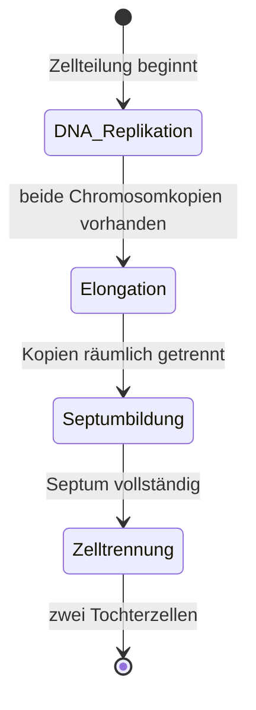

---
tags:
  - biologie
  - algorithmus
  - medienkunst
typ: theorie
bereich: biologie
---

# Zellteilung — Die vier Schritte der binären Spaltung

> Eine Zelle wird zu zwei. Vier Schritte, vollständig automatisch, ohne externe Steuerung. Der Vorgang ist das Ur-Programm: Zustand kopieren, Kopie trennen, System neu initialisieren. Grundlage aller Vermehrung, aller Evolution.

**Verwandte Themen:** [[bakterielle_vermehrung]] | [[anabolismus_katabolismus]] | [[horizontaler_gentransfer]] | [[endosporen]] | [[artificial_bacteria_konzept]] | [[__cosmicbrain__]]

---

## Der Ablauf im Überblick



---

## Schritt 1 — DNA-Replikation

Das einzige kreisförmige Chromosom der Bakterienzelle wird vollständig kopiert. Startpunkt: **oriC** (Origin of Replication) — ein spezifischer DNA-Abschnitt an dem die Replikationsmaschinerie andockt.

**Beteiligte Proteine:**
| Protein | Funktion |
|---|---|
| **Helicase** | Entwirrt und öffnet den Doppelstrang |
| **SSB-Proteine** | Halten den Einzelstrang offen |
| **Primase** | Synthetisiert kurzen RNA-Primer als Startpunkt |
| **DNA-Polymerase III** | Synthetisiert den neuen Strang (nur 5'→3'-Richtung) |
| **DNA-Ligase** | Verbindet Okazaki-Fragmente am Lagging Strand |

**Fehlerrate:** ~1:10⁷ Fehler beim Kopieren. Nach Reparatursystemen: ~1:10⁹ — eine Mutation pro Milliarde Basenpaare. Diese Rate ist nicht null. Das ist Evolution.

> Die Replikation läuft bidirektional vom oriC — zwei Replikationsgabeln wandern gleichzeitig um das Chromosom. Minimale Zeit, maximale Effizienz.

---

## Schritt 2 — Elongation

Nach vollständiger Replikation: die Zelle streckt sich. Die zwei Chromosomkopien werden durch aktive Mechanismen (**MreB-Zytoskelett**, **ParABS-System**) zu den gegenüberliegenden Zellpolen bewegt.

- Zellwachstum durch neues Material in der Seitenwand
- Länge verdoppelt sich vor der Teilung
- Segregation = aktiver Prozess, nicht passives Auseinanderdriften

**Zeitskala:** bei *E. coli* unter Optimalbedingungen ~10–15 Minuten der ~20-minütigen Gesamtteilung.

---

## Schritt 3 — Septumbildung

Das **FtsZ-Protein** polymerisiert zu einem Ring (**Z-Ring**) in der Zellmitte — genau zwischen den beiden Chromosomkopien. Der Z-Ring ist der erste sichtbare Schritt der physischen Teilung.

Weitere Proteine des **Divisoms** werden rekrutiert:
- **FtsA** — verankert Z-Ring an Membran
- **FtsK** — koordiniert Chromosom-Segregation mit Septumbildung
- **FtsI (PBP3)** — synthetisiert neues Peptidoglykan der Querwand

Der Z-Ring zieht sich zusammen wie ein Muskel — treibt das Einwachsen der neuen Membran und Zellwand von außen nach innen.

> FtsZ ist das bakterielle Tubulin — evolutionär verwandt mit dem eukaryotischen Zytoskelett. Das Ur-Protein der Zellteilung, über 2 Milliarden Jahre konserviert.

---

## Schritt 4 — Zelltrennung

Wenn das Septum vollständig ist, wird die Verbindung gekappt: Hydrolasen (Mureinsäcke-spaltende Enzyme) schneiden die gemeinsame Zellwand durch. Zwei vollständige Tochterzellen mit je einer DNA-Kopie.

Jede Tochterzelle ist **genetisch identisch** mit der Mutterzelle — bis auf Replikationsfehler (~1:10⁹). Diese Fehler sind der Rohmaterial der Evolution.

---

## Die vier Schritte als Algorithmus

```
INITIALISIERUNG:
  if (ressourcen >= schwellenwert && schäden == 0):
    starte zellteilung()

zellteilung():
  1. kopiere(chromosom)           // DNA-Replikation
  2. segregiere(chromosomkopien)  // Elongation
  3. markiere(teilungsebene)      // Septumbildung (Z-Ring)
  4. trenne(zelle)                // Zelltrennung
  return [tochterzelle_1, tochterzelle_2]
```

Keine Subroutine kennt das Ergebnis. Keine Subroutine kennt die Population. Nur lokale Signale, lokale Proteine, lokale Entscheidungen.

---

## Medienkünstlerische Perspektive

Die binäre Spaltung ist der erste rekursive Algorithmus der Natur. Ein Zustand erzeugt sich selbst neu — aber nicht identisch, sondern mit minimaler Abweichung. Diese Abweichung ist keine Fehlfunktion, sie ist der Motor der Anpassung. Systeme die sich perfekt kopieren, lernen nichts. Systeme die nie kopieren, verschwinden.

Die Frage für das Werk: **Was ist die Fehlerrate des eigenen Systems?**

---

## Summary (EN)

Binary fission — the bacterial division cycle — proceeds in four steps: DNA replication (oriC-initiated bidirectional copying), elongation (chromosome segregation to poles), septum formation (FtsZ Z-ring constriction), and cell separation (hydrolase-mediated wall cleavage). Each step is locally determined; no protein knows the full context. Error rate after repair: ~1:10⁹ — the seed of evolution. The division protocol is the original recursive algorithm: state → copy state → separate → repeat.
