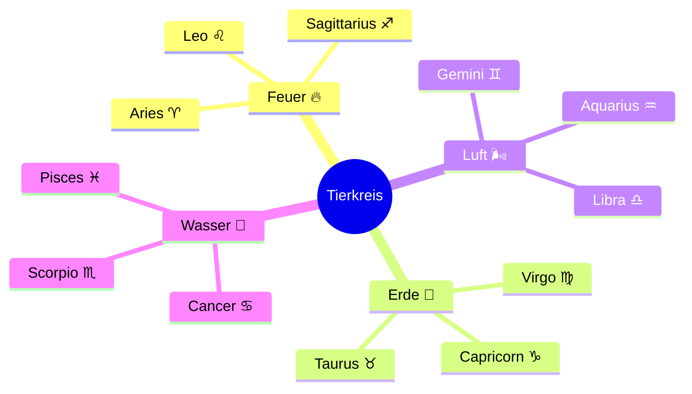
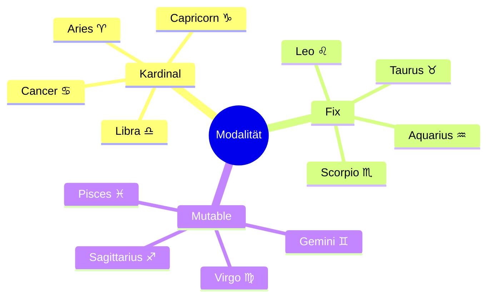

---
tags:
  - dataview
  - sternzeichen
  - referenz
typ: referenz
bereich: system
---

# Dataview — Sternzeichen

## Schaubilder

### Element-Mindmap



### Modalitäts-Mindmap



---

## Alle Sternzeichen

```dataview
TABLE element, modalitaet
FROM "resources/sternzeichen"
SORT element ASC
```

---

## Nach Element

### Feuer ♈ ♌ ♐

```dataview
LIST
FROM "resources/sternzeichen"
WHERE element = "feuer"
SORT file.name ASC
```

### Erde ♉ ♍ ♑

```dataview
LIST
FROM "resources/sternzeichen"
WHERE element = "erde"
SORT file.name ASC
```

### Luft ♊ ♎ ♒

```dataview
LIST
FROM "resources/sternzeichen"
WHERE element = "luft"
SORT file.name ASC
```

### Wasser ♋ ♏ ♓

```dataview
LIST
FROM "resources/sternzeichen"
WHERE element = "wasser"
SORT file.name ASC
```

---

## Nach Modalität

### Kardinal (Beginner)

```dataview
LIST
FROM "resources/sternzeichen"
WHERE modalitaet = "kardinal"
SORT file.name ASC
```

### Fix (Bewahrer)

```dataview
LIST
FROM "resources/sternzeichen"
WHERE modalitaet = "fix"
SORT file.name ASC
```

### Mutable (Wandler)

```dataview
LIST
FROM "resources/sternzeichen"
WHERE modalitaet = "mutable"
SORT file.name ASC
```

---

## Vollständige Matrix

```dataview
TABLE WITHOUT ID
  file.link AS Zeichen,
  element AS Element,
  modalitaet AS Modalität
FROM "resources/sternzeichen"
SORT element ASC, modalitaet ASC
```
