---
tags:
  - cosmicalchemy
  - element
  - aether
typ: element
element: aether
bereich: cosmicalchemy
---

# ✦ Äther — das Fünfte Element · Quintessenz · Raum

> Das Element das die anderen vier durchdringt und enthält. Nicht Feuer, Wasser, Erde oder Luft — sondern das Medium in dem sie alle existieren. Äther ist Raum selbst: unveränderlich, allgegenwärtig, nicht greifbar. In der olfaktorischen Alchemie: die Stille zwischen den Noten, die Stimmigkeit eines Blends der mehr ist als die Summe seiner Bestandteile.

**Verwandte Themen:** [[__cosmicbrain__]] | [[scentlist]] | [[cosmicalchemys]] | [[feuer]] | [[erde]] | [[luft]] | [[wasser]]

---

## Eigenschaften

| | |
|:--|:--|
| symbol | ✦ |
| qualitäten | keiner der vier Qualtitäten — jenseits von warm/kalt, trocken/feucht |
| prinzip | Quintessenz · Ganzheit · Stille · Raum |
| polarität | keine — Aufhebung der Polarität |
| sternzeichen | kein spezifisches — das Äther-Prinzip durchzieht alle Zeichen |
| farbe | violett · schwarz · weißes Licht |
| richtung | Zentrum · oben |
| jahreszeit | keine — oder alle zugleich |

---

## Die Quintessenz — fünftes Element

Aristoteles fügte Äther (*aithēr*) als fünfte Substanz hinzu: das Material aus dem die Himmelssphären bestehen — unvergänglich, kreisend, vollkommen. Anders als die vier sublunaren Elemente unterliegt Äther nicht dem Werden und Vergehen. Es ist das Substrat der ewigen Bewegung.

Paracelsus nennt es *Quinta Essentia* — der reinste Extrakt, das konzentrierteste Wesen einer Substanz. Destillation als Methode: was bleibt wenn alles Unreine entfernt wird? Was ist der Kern hinter der Form?

---

## Äther in der olfaktorischen Alchemie

Äther hat keine eigene Note — es *ist* der Moment wenn ein Blend kohärent wird. Wenn die Summe aus Zimt, Palmarosa und Benzoin plötzlich eine Stimmung erzeugt die keine der Einzelkomponenten allein hätte. Der akkordische Duft — der Raum zwischen den Molekülen.

In [[cosmicalchemys]]: das Präfix ✦ vor dem Projektnamen ist Äther-Referenz — der Raum des Ganzen, nicht die Einzelbestandteile.

| Analogie | Äther-Entsprechung |
|:--|:--|
| Musik | der Klang des Raums · Hall · Stille zwischen den Tönen |
| Duft | Akkord · Stimmigkeit · was bleibt nach dem Verflüchtigen |
| Farbe | weißes Licht = alle Farben zugleich |
| Alchemie | Destillat · Tinktur · das Gereinigte |

---

## Destillation als Äther-Praxis

Das Prinzip der Quintessenz ist Destillation: ein Stoff wird erhitzt, verdampft, kondensiert — das Wesentliche trennt sich vom Substrat. Ätherische Öle (*essential oils*) tragen Äther im Namen: das Leichteste, Flüchtigste, Wesentlichste der Pflanze. Nicht die Pflanze selbst — ihr Atem, ihr Geist, ihre Signatur.

→ [[scentlist]]: alle Einträge sind Quintessenzen ihrer pflanzlichen Ursprünge — extrahierte Essenzen, nicht Rohmmaterialien.

---

## Medienkünstlerische Perspektive

Äther ist das Konzept des unsichtbaren Mediums — das trägt ohne zu sein. Im 19. Jahrhundert postulierte die Physik den *Lichtäther* als Trägermedium elektromagnetischer Wellen: er musste existieren, weil Wellen ein Medium brauchen. Das Michelson-Morley-Experiment widerlegte ihn 1887 — und Einstein ersetzte das Medium durch Raumzeit selbst.

Medienkünstlerisch: Was ist das Medium wenn es kein Substrat gibt? Was überträgt wenn nichts da ist? Duft ist die Antwort: Moleküle die durch Nichts reisen und trotzdem ankommen. [[luft]] ist das physische Medium, Äther das konzeptionelle.

```mermaid
graph TD
    A[✦ Äther]
    A --> B[△ Feuer]
    A --> C[▪ Erde]
    A --> D[◯ Luft]
    A --> E[◇ Wasser]
    B & C & D & E -->|Quintessenz| F[✦ zurück zum Ganzen]
    style A fill:#1a0a2a,stroke:#a6a
    style F fill:#1a0a2a,stroke:#a6a
```

---

## Elementare Korrespondenzen

- **Aristoteles:** *aithēr* — unveränderliche, kreisende Himmelssubstanz
- **Paracelsus:** *Quinta Essentia* — das Reinste, Destillierte, Konzentrierteste
- **Hermetik:** *As above, so below* — Äther als Verbindung von Mikro- und Makrokosmos
- **Moderne Physik:** Raumzeit als Nachfolger des Lichtäthers — das Feld das Wellen ermöglicht

---

## Summary (EN)

Aether is the fifth element — not fire, water, earth, or air, but the medium in which all four exist. In classical cosmology: the imperishable substance of the celestial spheres. In alchemy (Paracelsus): quintessence, the purest distillate of any substance. In cosmic alchemy: the coherence of a blend that transcends its parts, the room between the notes, the accord. In media art: the concept of the invisible medium — that which transmits without being seen. Every essential oil is a quintessence; every resonant blend is a moment of aether.
