---
tags:
  - cosmicalchemy
  - element
  - erde
typ: element
element: erde
bereich: cosmicalchemy
---

# ▪ Erde — Substanz · Beständigkeit · Form

> Das dichteste Element. Erde ist nicht passiv — sie trägt, hält, formt. Was existiert, existiert weil es Boden hat. In der olfaktorischen Alchemie: tief, holzig, moosig, verwurzelnd. Das Element das nicht vergeht, sondern akkumuliert.

**Verwandte Themen:** [[__cosmicbrain__]] | [[scentlist]] | [[cosmicalchemys]] | [[feuer]] | [[wasser]] | [[luft]] | [[aether]]

---

## Eigenschaften

| | |
|:--|:--|
| symbol | ▪ |
| qualitäten | kalt · trocken |
| prinzip | Substanz · Struktur · Akkumulation |
| polarität | rezeptiv · yin |
| sternzeichen | ♉ [[taurus\|Taurus]] · ♍ [[virgo\|Virgo]] · ♑ [[capricorn\|Capricorn]] |
| farbe | braun · ocker · tiefgrün |
| richtung | Norden |
| jahreszeit | Winter |

---

## Düfte — Erde-Signaturen

*Aus dem [[scentlist]]: schwere, verwurzelnde, erdige Base Notes*

| Duft | Note | Profil |
|:--|:--|:--|
| [[scentlist#Patchouli\|Patchouli]] | base | erdig · tief · moosig |
| [[scentlist#Vetiver\|Vetiver]] | base | rauchig · holzig · trocken |
| [[scentlist#Cedarwood\|Cedarwood]] | base | holzig · warm · stabil |
| [[scentlist#Himalayan Cedarwood\|Himalayan Cedarwood]] | base | holzig · kühl · trocken |
| [[scentlist#Styrax\|Styrax]] | base | rauchig · balsamisch *(+Feuer)* |

---

## Blends — Erde-Kompositionen

*Aus [[cosmicalchemys]]: Erde als dominantes Element*

→ [[cosmicalchemys#Virgo]] — *Grounded Clarity and Refined Balance*
→ [[cosmicalchemys#Capricorn Cla]] — *Grounded Ambition and Warm Wisdom*
→ [[cosmicalchemys#Capricorn Sin]] — *Grounded Ambition and Warm Wisdom*
→ [[cosmicalchemys#Libra Velvet Axis]] — *Sexy · wild · balanced* *(Erde + Luft)*

---

## Olfaktorische Charakteristik

Erde-Düfte arbeiten in der Zeit — sie brauchen Wärme (Körperwärme, Reibung, Geduld) um sich zu entfalten. Patchouli ändert seinen Charakter über Stunden: anfangs streng und fermentiert, dann weich und samtig. Vetiver bleibt dunkel und rauchig, fast like gerochen ohne Anstrengung — es ist einfach da, wie Boden.

Die chemischen Träger: **Patchoulol** (Patchouli), **Khusimol** (Vetiver), **Cedrol/Cedrene** (Zeder) — komplexe sesquiterpenoide Strukturen die langsam und anhaltend verdampfen. Erde als Base Note ist Struktur: das Fundament auf dem Kopf- und Herznoten erst Bedeutung bekommen.

---

## Medienkünstlerische Perspektive

Erde ist Persistenz — Material das bleibt wenn alles andere sich aufgelöst hat. In Installationen: der Träger, das Substrat, die Oberfläche auf der sich Prozesse abspielen. Verwandtschaft mit [[kalziumkarbonat]]: mineralisierte Strukturen die von Lebewesen gebaut wurden und dann bleiben, lange nach ihrem Tod.

Erde-Düfte sind anti-spektakulär. Sie fordern keine Aufmerksamkeit — sie sind einfach präsent. Das Gegenteil des Clickbait-Duftes. In einer Welt der Top Notes ist Vetiver eine politische Aussage.

```mermaid
graph LR
    A[Erde] -->|trägt| B[Struktur · Form]
    B -->|ermöglicht| C[Persistenz]
    A -->|resoniert mit| D[♉ Taurus · ♍ Virgo · ♑ Capricorn]
    A -->|Düfte| E[Patchouli · Vetiver · Zeder]
    style A fill:#1a1200,stroke:#876
```

---

## Elementare Korrespondenzen

- **Alchemie:** Sal (*Salz*) — das fixierte, körperliche Prinzip
- **Ayurveda:** Kapha-Dosha — Schwere, Stabilität, Struktur, Kälte
- **Chinesische Medizin:** Milz/Magen — Nahrung, Transformation des Materiellen
- **Paracelsus:** Gnome — Erdgeister, Hüter der Mineralien und Metalle

---

## Summary (EN)

Earth is the densest of the classical elements — not passive, but foundational. In cosmic alchemy, earth-signature scents (patchouli, vetiver, cedarwood) work slowly, through accumulation of warmth, revealing themselves over hours. Chemically: sesquiterpenoids with low volatility, the architectural layer of a blend. In media art: the element of persistence, substrate, material that outlasts its process. Corresponds to earth signs Taurus, Virgo, Capricorn.
