---
tags:
  - cosmicalchemy
  - element
  - feuer
typ: element
element: feuer
bereich: cosmicalchemy
---

# △ Feuer — Transformation · Energie · Wille

> Das aktivste der vier klassischen Elemente. Feuer zerstört und erschafft gleichzeitig — es ist nie neutral, immer tätig. In der olfaktorischen Alchemie: scharf, warm, würzig, weckend. Das Element das antreibt, nicht das das trägt.

**Verwandte Themen:** [[__cosmicbrain__]] | [[scentlist]] | [[cosmicalchemys]] | [[erde]] | [[wasser]] | [[luft]] | [[aether]]

---

## Eigenschaften

| | |
|:--|:--|
| symbol | △ |
| qualitäten | warm · trocken |
| prinzip | Transformation · Aktivierung · Wille |
| polarität | aktiv · yang |
| sternzeichen | ♈ [[aries\|Aries]] · ♌ [[leo\|Leo]] · ♐ [[sagittarius\|Sagittarius]] |
| farbe | rot · orange · gold |
| richtung | Süden |
| jahreszeit | Sommer |

---

## Düfte — Feuer-Signaturen

*Aus dem [[scentlist]]: volatile, wärmende, anregende Noten*

| Duft | Note | Profil |
|:--|:--|:--|
| [[scentlist#Cinnamon Bark\|Cinnamon Bark]] | top/middle | warm · spicy · süß |
| [[scentlist#Ginger\|Ginger]] | top/heart | würzig · scharf · belebend |
| [[scentlist#Benzoin Siam\|Benzoin Siam]] | base | süß · vanillig · warm |
| [[scentlist#Tonka Bean\|Tonka Bean]] | base | süß · Coumarin-Wärme |
| [[scentlist#Vanilla Extract\|Vanilla Extract]] | base | süß · cremig · warm |
| [[scentlist#Styrax\|Styrax]] | base | rauchig · balsamisch · harzend |

---

## Blends — Feuer-Kompositionen

*Aus [[cosmicalchemys]]: Feuer als dominantes Element*

→ [[cosmicalchemys#Mars]] — *Fiery Passion and Assertive Strength*
→ [[cosmicalchemys#Aries]] — *Dynamic Energy and Bold Warmth*
→ [[cosmicalchemys#Leo]] — *Radiant Energy and Regal Warmth*
→ [[cosmicalchemys#Leo-Cancer]] — *Nurturing Radiance and Emotional Warmth* *(Feuer + Wasser)*
→ [[cosmicalchemys#Sagittarius]] — *Cosmic Warmth and Vibrant Energy*

---

## Olfaktorische Charakteristik

Feuer-Düfte aktivieren vor allem den vorderen Teil der Wahrnehmung — sie greifen zuerst. Top Notes mit Pfeffer, Zitrus, Ingwer erzeugen sofortige Präsenz. Base Notes wie Benzoin und Tonka halten die Wärme nach — Feuer das sich in die Haut einschreibt, nachhallend, als Erinnerung an Energie.

Die chemischen Träger: **Cinnamaldehyd** (Zimt), **Gingerol** (Ingwer), **Cumarin** (Tonka) — Moleküle die buchstäblich Wärme- und Schmerzrezeptoren aktivieren. Der Körper riecht Feuer und *fühlt* es gleichzeitig.

---

## Medienkünstlerische Perspektive

Feuer ist das Element der Handlung ohne Umkehr — der Punkt ab dem nichts mehr so ist wie vorher. In Installationen: das Moment der Aktivierung, der Zündung, des Beginns eines irreversiblen Prozesses. Nicht destruktiv, sondern transformativ — das Harz das verbrennt um Parfüm zu werden, das Material das seine Form verlieren muss um Bedeutung zu gewinnen.

Verbindung zu [[anabolismus_katabolismus]]: Feuer ist reiner Katabolismus — steckt aber den Raum für Anabolismus ab. Asche als Substrat. Die Energie die freigesetzt wird wenn Verbindungen brechen.

```mermaid
graph LR
    A[Feuer] -->|aktiviert| B[Transformation]
    B -->|ermöglicht| C[Neues]
    A -->|resoniert mit| D[♈ Aries · ♌ Leo · ♐ Sagittarius]
    A -->|Düfte| E[Zimt · Ingwer · Benzoin]
    style A fill:#3a1a00,stroke:#c84
```

---

## Elementare Korrespondenzen

- **Alchemie:** Schwefel (*sulphur*) — das aktive, maskuline Prinzip
- **Ayurveda:** Pitta-Dosha — Wärme, Verdauung, Transformation
- **Chinesische Medizin:** Herz/Dünndarm — Freude, Begeisterung, Ausschlag
- **Paracelsus:** Salamander — das Wesen das im Feuer lebt und nicht verbrennt

---

## Summary (EN)

Fire is the most volatile of the classical elements — active, transformative, never neutral. In cosmic alchemy, fire-signature scents (cinnamon, ginger, benzoin, tonka) work through warmth, spice, and immediacy. Chemically, many fire-scents activate thermoreceptors: the body doesn't just smell fire, it feels it. In media art: the element of irreversible process, activation, the moment that cannot be undone. Corresponds to fire signs Aries, Leo, Sagittarius.
