---
tags:
  - cosmicalchemy
  - element
  - luft
typ: element
element: luft
bereich: cosmicalchemy
---

# ◯ Luft — Bewegung · Klarheit · Verbindung

> Das flüchtigste unter den schweren Elementen. Luft ist das Medium der Übertragung — Duft selbst ist Luft, ist flüchtige Moleküle die sich durch den Raum bewegen und Kontakt herstellen. Ohne Luft kein Riechen. Das Element ist sein Medium.

**Verwandte Themen:** [[__cosmicbrain__]] | [[scentlist]] | [[cosmicalchemys]] | [[feuer]] | [[erde]] | [[wasser]] | [[aether]]

---

## Eigenschaften

| | |
|:--|:--|
| symbol | ◯ |
| qualitäten | warm · feucht |
| prinzip | Bewegung · Kommunikation · Übergang |
| polarität | aktiv · yang |
| sternzeichen | ♊ [[gemini\|Gemini]] · ♎ [[libra\|Libra]] · ♒ [[aquarius\|Aquarius]] |
| farbe | weiß · hellblau · silber |
| richtung | Osten |
| jahreszeit | Frühling |

---

## Düfte — Luft-Signaturen

*Aus dem [[scentlist]]: helle, flüchtige, klärende Top Notes*

| Duft | Note | Profil |
|:--|:--|:--|
| [[scentlist#Grapefruit\|Grapefruit]] | top | frisch · fruchtig · leicht bitter |
| [[scentlist#Lemon\|Lemon]] | top | zitrisch · frisch · zesty |
| [[scentlist#Bergamot\|Bergamot]] | top | zitrisch · leicht blumig · leicht süß |
| [[scentlist#Himalayan Cedarwood\|Himalayan Cedarwood]] | base | holzig · kühl · leicht campherig *(+Erde)* |

---

## Blends — Luft-Kompositionen

*Aus [[cosmicalchemys]]: Luft als dominantes Element*

→ [[cosmicalchemys#Libra Velvet Axis]] — *Sexy · wild · balanced · elegant · magnetic* *(Luft + Erde)*
→ [[cosmicalchemys#Aquarius Static Bloom]] — *Electric freshness · airy clarity · soft warmth*

---

## Olfaktorische Charakteristik

Luft-Düfte sind der erste Eindruck — sie kommen an, bevor der Verstand bereit ist. Die flüchtigen Aldehyde und Terpene der Zitrusöle (Limonene, Linalool, Bergapten) sind hochmobil: sie greifen schnell, treffen Limbiksystem direkt, sind nach 20 Minuten fast verschwunden. Luft ist das Element das *verspricht* bevor es *liefert*.

Bergamot ist die komplexeste Luft-Note: durch den Anteil von Linalool und Linalylacetat liegt sie zwischen Zitrus und Blume, zwischen Aktivierung und Beruhigung — Luft als Balance-Punkt.

---

## Medienkünstlerische Perspektive

Luft ist das Paradox des Duftmediums selbst: Geruch existiert nur weil Moleküle sich vom Ding lösen und durch den Raum zur Nase wandern. Jeder Geruch ist Verlust — das Objekt gibt von sich ab um wahrgenommen zu werden. In der Medienkunst: das Medium als Substanzverlust, die Übertragung als Auflösung.

Verbindung zu [[biosemiotik]]: Phytosemiotik funktioniert über volatile organic compounds (VOCs) — Pflanzenkommunikation ist Luft-Kommunikation. Das Signal reist durch das Medium Luft. Duftinstallationen als Phytosemiotik-Simulation.

```mermaid
graph LR
    A[Luft] -->|trägt| B[Moleküle · Signale]
    B -->|verbindet| C[Sender ↔ Empfänger]
    A -->|resoniert mit| D[♊ Gemini · ♎ Libra · ♒ Aquarius]
    A -->|Düfte| E[Zitrus · Bergamot · Grapefruit]
    style A fill:#0a1a2a,stroke:#68a
```

---

## Elementare Korrespondenzen

- **Alchemie:** Merkur (*mercurius*) — das flüchtige, verbindende Prinzip
- **Ayurveda:** Vata-Dosha — Bewegung, Leichtigkeit, Unbeständigkeit
- **Chinesische Medizin:** Lunge/Dickdarm — Einatmen des Neuen, Loslassen
- **Paracelsus:** Sylphen — Luftgeister, Überbringer von Ideen und Worten

---

## Summary (EN)

Air is the medium of transmission — and scent *is* air, volatile molecules moving through space to make contact. In cosmic alchemy, air-signature scents (citrus, bergamot, grapefruit) are top notes: fast, bright, communicative, fleeting. Chemically: light terpenes (limonene, linalool) that arrive instantly and dissipate within minutes. In media art: the element of transmission, connection, and transience — the signal that travels by giving itself away. Corresponds to air signs Gemini, Libra, Aquarius.
