---
tags:
  - cosmicalchemy
  - element
  - wasser
typ: element
element: wasser
bereich: cosmicalchemy
---

# ◇ Wasser — Tiefe · Fluss · Gedächtnis

> Das Element der Lösung und der Verbindung. Wasser nimmt jede Form an und behält keine — und doch erinnert es. In der olfaktorischen Alchemie: weich, blumig, feucht, rund. Das Element das verbindet ohne selbst sichtbar zu sein.

**Verwandte Themen:** [[__cosmicbrain__]] | [[scentlist]] | [[cosmicalchemys]] | [[feuer]] | [[erde]] | [[luft]] | [[aether]]

---

## Eigenschaften

| | |
|:--|:--|
| symbol | ◇ |
| qualitäten | kalt · feucht |
| prinzip | Fluss · Empfindung · Gedächtnis |
| polarität | rezeptiv · yin |
| sternzeichen | ♋ [[cancer\|Cancer]] · ♏ [[scorpio\|Scorpio]] · ♓ [[pisces\|Pisces]] |
| farbe | blau · silber · tiefviolett |
| richtung | Westen |
| jahreszeit | Herbst |

---

## Düfte — Wasser-Signaturen

*Aus dem [[scentlist]]: verbindende, weiche, florale Heart Notes*

| Duft | Note | Profil |
|:--|:--|:--|
| [[scentlist#Palmarosa\|Palmarosa]] | heart | floral · leicht süß · regenerierend |
| [[scentlist#Rosewood\|Rosewood]] | heart | floral · weich · leicht würzig |
| [[scentlist#Vanilla Extract\|Vanilla Extract]] | base | süß · cremig · warm *(+Feuer)* |

---

## Blends — Wasser-Kompositionen

*Aus [[cosmicalchemys]]: Wasser als Element (rein oder gemischt)*

→ [[cosmicalchemys#Leo-Cancer]] — *Nurturing Radiance and Emotional Warmth* *(Wasser + Feuer)*
→ [[cosmicalchemys#Aquarius Static Bloom]] — *Electric freshness · airy clarity · soft warmth* *(enthält Palmarosa/Rosewood)*

---

## Olfaktorische Charakteristik

Wasser-Düfte verbinden — sie sind die Brücken-Noten in einer Komposition, die das Harte weich machen und das Leichte erden. Palmarosa ist das Wasser im Duft: es vermittelt zwischen süßen Bases und frischen Tops, zwischen Feuer und Luft. Rosewood fügt Tiefe hinzu ohne zu beschweren.

Die chemischen Träger: **Geraniol** (Palmarosa), **Linalool** und **Rosenoxid** (Rosewood) — Alkohole die weich öffnen und langsam schließen. Wasser-Düfte haben keine harten Kanten. Sie lassen sich nicht isolieren — sie verbinden sich immer mit dem Rest.

---

## Medienkünstlerische Perspektive

Wasser ist das Lösungsmittel der Alchemie — das Medium in dem Reaktionen stattfinden. Ohne Wasser kein Zerfall, keine Kristallisation, kein Leben. In [[artificial_bacteria_konzept]]: das wässrige Medium ist der geteilte Raum in dem die Einheiten kommunizieren. Wasser als kollektives Substrat.

Verbindung zu [[semipermeable_membran]]: Was hindurchkommt, was zurückgehalten wird — das definiert Wasser. Nicht die Substanz selbst, sondern die Grenze ihrer Bewegung. Eine Duftinstallation ist eine Wasserfrage: was löst sich auf, was bleibt?

```mermaid
graph LR
    A[Wasser] -->|verbindet| B[Verbindung · Auflösung]
    B -->|ermöglicht| C[Reaktion · Wandel]
    A -->|resoniert mit| D[♋ Cancer · ♏ Scorpio · ♓ Pisces]
    A -->|Düfte| E[Palmarosa · Rosewood · Vanille]
    style A fill:#001a2a,stroke:#468
```

---

## Elementare Korrespondenzen

- **Alchemie:** Quecksilber als *materia prima* — flüssig, formlos, transformierbar
- **Ayurveda:** Kapha-Dosha *(mit Erde)* — Bindung, Kohäsion, Feuchtigkeit
- **Chinesische Medizin:** Nieren/Blase — Urgefühl, Lebensessenz (*Jing*), Angst
- **Paracelsus:** Undinen — Wassergeister, Verkörperungen der flüssigen Seele

---

## Summary (EN)

Water is the element of flow, memory, and connection — formless yet retentive. In cosmic alchemy, water-signature scents (palmarosa, rosewood, vanilla) are the bridge notes in a composition: soft, floral, round, mediating between extremes. Chemically: alcohols (geraniol, linalool) that open gently and close slowly. In media art: the solvent in which processes happen, the shared medium of communication and dissolution. Corresponds to water signs Cancer, Scorpio, Pisces.
