---
tags:
  - psychologie
  - emotion
  - medienkunst
typ: theorie
bereich: psychologie
---

# Emotionale Granularität — Die Präzision des Fühlens

> Die Fähigkeit, eigene Gefühlszustände präzise zu unterscheiden und zu benennen. Je feiner die Granularität, desto genauer die Selbstwahrnehmung — und desto besser die psychische Resilienz. Rohe Emotion vs. differenziertes emotionales Vokabular.

**Verwandte Themen:** [[__cosmicbrain__]] | [[__sandbox__]] | [[projects/esp_ai_art/README.md]]

---

## Grundidee

Emotionale Granularität beschreibt wie feinkörnig jemand seine emotionalen Zustände wahrnimmt und kategorisiert. Der Begriff stammt aus der Affektforschung, geprägt durch Lisa Feldman Barrett (*How Emotions Are Made*, 2017).

**Niedrige Granularität:** "Ich fühle mich schlecht" — ein grober, undifferenzierter Zustand.  
**Hohe Granularität:** "Ich bin enttäuscht und etwas beschämt, aber nicht wütend" — präzise Differenzierung.

Das ist keine rein linguistische Fähigkeit. Emotionale Granularität ist eng verknüpft mit:
- **Interoception** — Wahrnehmung körperlicher Signale (Herzrate, Anspannung, Atemfrequenz)
- **Affective Labeling** — Benennen von Zuständen verändert ihre neuronale Verarbeitung
- **Emotionsregulation** — wer präzise versteht was er fühlt, kann gezielter reagieren

---

## Wissenschaftlicher Hintergrund

Lisa Feldman Barrett argumentiert, dass Emotionen nicht universell und biologisch fix sind, sondern konstruiert — aus Vorerfahrung, Körpersignalen und konzeptuellen Kategorien. Emotionale Granularität ist demnach erlernbar: Menschen mit breiterem emotionalen Vokabular erleben Emotionen buchstäblich anders.

Empirische Befunde:
- Hohe Granularität korreliert mit geringerer Aggression bei Frustration
- Hohe Granularität korreliert mit weniger Alkohol- und Drogenkonsum nach Stress
- fEMG (Gesichts-Elektromyografie) und Hautleitfähigkeit können zwischen differenzierten Zuständen unterscheiden, die subjektiv ähnlich scheinen

Verbindung zu [[__cosmicbrain__#G|Gesichts-Elektromyografie (fEMG)]]: fEMG misst muskuläre Mikrosignale die emotionale Reaktionen kodieren — da wo Granularität beginnt, bevor sie in Sprache übersetzt wird.

---

## Medienkünstlerische Perspektive

**Maschinen simulieren Granularität** — Sprachmodelle geben differenzierte emotionale Outputs, ohne einen Körper zu haben, ohne Interoception, ohne Vorerfahrung. Ist das emotionale Granularität oder ihre Imitation?

**Granularität als Interface-Design** — Systeme die nur binäre oder grobe emotionale Inputs verarbeiten (gut/schlecht, like/dislike) erzwingen niedrige Granularität beim Nutzer. Social Media ist ein granularitätsfeindliches System: ein Like-Button für Freude, Überraschung, Stolz, Rührung, Bewunderung.

**Messung vs. Erleben** — Messingstrumente wie fEMG erfassen physiologische Korrelate von Emotion ohne die subjektive Qualität. Die Maschine misst Granularität ohne sie zu erleben.

```mermaid
graph LR
    E[Emotionaler Zustand]
    L[Niedrige Granularität\n'schlecht' / 'gut']
    H[Hohe Granularität\n'enttäuscht' / 'erschöpft' / 'beschämt']
    R1[Undifferenzierte Reaktion]
    R2[Gezielte, adaptierte Reaktion]
    E --> L --> R1
    E --> H --> R2
    style L fill:#3a1a1a,stroke:#a44
    style H fill:#1a3a1a,stroke:#4a8
```

---

## Verbindung zu esp_ai_art

Im Projekt [[projects/esp_ai_art/README.md|ESP AI Art / Cosmic Orakel]] klassifiziert das System soziale Begegnungen entlang von 6 Parametern. Das ist ein Ansatz zur maschinellen Annäherung an emotionale Granularität: nicht "war es gut oder schlecht?" sondern "war es GEBER, VAMPIR oder NEBEL?" — eine erste, grobe Granularität. Die Frage: Wie viele Dimensionen bräuchte ein System um emotionale Zustände wirklich feinkörnig zu erfassen?

---

## Referenzen

- Lisa Feldman Barrett — *How Emotions Are Made* (2017) → [[literatur]]
- Charles Darwin — *Der Ausdruck der Gemütsbewegung bei Tieren und Menschen* → [[literatur]]
- → [[__sandbox__#Fingerabdruck der Gefühle]]

---

## Summary (EN)

Emotional granularity is the ability to precisely distinguish and name one's own emotional states. High granularity correlates with better psychological resilience, lower reactivity, and more adaptive behaviour. In media art: machines that simulate granularity without experiencing it; interfaces that enforce low granularity (the Like button); measurement tools (fEMG) that capture physiological correlates of emotion without subjective experience. A key question for AI systems: can granularity be learned without a body?
