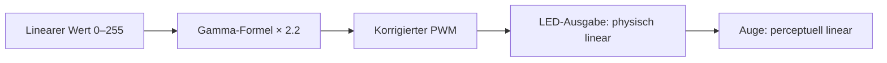

# Gamma-Korrektur — LEDs und menschliche Wahrnehmung

> Nichtlineare Helligkeitsanpassung die die logarithmische Wahrnehmung des menschlichen Auges kompensiert. LEDs sind linear — das Auge nicht. Gamma-Korrektur ist die Übersetzungsschicht zwischen Maschinen-Ausgabe und körperlicher Erfahrung.

**Verwandte Themen:** [[interoception_affective_labeling]] | [[zellulaere_automaten]] | [[artificial_bacteria_technik]] | [[__sandbox__]]

---

## Das Problem: Linearität gegen Logarithmus

LEDs sind lineare Bauteile: doppelter PWM-Wert = doppelte Lichtmenge. Das menschliche Auge folgt dem **Weber-Fechner-Gesetz**: Helligkeitsunterschiede in dunklen Bereichen werden stärker wahrgenommen als in hellen — Wahrnehmung ist logarithmisch, nicht linear.

**Resultat ohne Gamma-Korrektur:**
- Dunkle Bereiche wirken übersprungen / zu abrupt hell
- Helle Bereiche wirken komprimiert / undifferenziert
- Farbverläufe brechen statt zu fließen

## Die Gamma-Funktion

$$L_{\text{out}} = L_{\text{in}}^{\,\gamma}$$

Standardwert: $\gamma = 2{,}2$ (sRGB-Standard). Inverse Korrektur für LEDs:

$$\text{PWM} = \left(\frac{\text{Helligkeitswert}}{255}\right)^{2{,}2} \times 255$$



## Perzeptuelle Grundlage

**Weber-Fechner-Gesetz** (1860): Die wahrgenommene Intensität ist proportional zum Logarithmus der physischen Intensität. Gilt für Licht, Ton, Druck, Temperatur — ein universelles Prinzip sensorischer Verarbeitung.

**Stevens' Potenzgesetz** (neuere Formulierung): Für Licht: $\psi = k \cdot I^{0{,}33}$ — das Auge *komprimiert* hohe Intensitäten.

Das Auge wurde für natürliches Licht kalibriert: Sonnenaufgang, Feuer, Mondlicht. LEDs kamen später — der Körper kennt keine Lookup-Table.

## Praxis: Arduino / ESP / FastLED

**Lookup-Table (8-bit):**

```cpp
// Gamma 2.2 — 256 korrigierte Werte
const uint8_t PROGMEM gamma8[] = {
    0,   0,   0,   0,   0,   0,   0,   0,
    0,   0,   0,   0,   0,   0,   0,   0,
    0,   0,   0,   0,   0,   0,   0,   0,
    0,   0,   0,   0,   1,   1,   1,   1,
    1,   1,   1,   1,   1,   1,   1,   1,
    1,   2,   2,   2,   2,   2,   2,   2,
    2,   3,   3,   3,   3,   3,   3,   3,
    4,   4,   4,   4,   4,   5,   5,   5,
    5,   6,   6,   6,   6,   7,   7,   7,
    7,   8,   8,   8,   9,   9,   9,  10,
   10,  10,  11,  11,  11,  12,  12,  13,
   13,  13,  14,  14,  15,  15,  16,  16,
   17,  17,  18,  18,  19,  19,  20,  20,
   21,  21,  22,  22,  23,  24,  24,  25,
   25,  26,  27,  27,  28,  29,  29,  30,
   31,  32,  32,  33,  34,  35,  35,  36,
   37,  38,  39,  39,  40,  41,  42,  43,
   44,  45,  46,  47,  48,  49,  50,  50,
   51,  52,  54,  55,  56,  57,  58,  59,
   60,  61,  62,  63,  64,  66,  67,  68,
   69,  70,  72,  73,  74,  75,  77,  78,
   79,  81,  82,  83,  85,  86,  87,  89,
   90,  92,  93,  95,  96,  98,  99, 101,
  102, 104, 105, 107, 109, 110, 112, 114,
  115, 117, 119, 120, 122, 124, 126, 127,
  129, 131, 133, 135, 137, 138, 140, 142,
  144, 146, 148, 150, 152, 154, 156, 158,
  160, 162, 164, 167, 169, 171, 173, 175,
  177, 180, 182, 184, 186, 189, 191, 193,
  196, 198, 200, 203, 205, 208, 210, 213,
  215, 218, 220, 223, 225, 228, 231, 233,
  236, 239, 241, 244, 247, 249, 252, 255
};

uint8_t corrected = pgm_read_byte(&gamma8[rawValue]);
```

**FastLED** (eingebaut): `FastLED.setBrightness(255)` + `FastLED.setCorrection(TypicalLEDStrip)` aktiviert interne Gamma-Korrektur.

**NeoPixel**: `strip.gamma32()` für 32-bit Farbwerte.

## Medienkünstlerischer Kontext

Jede LED-Installation ist implizit eine Aussage über die Differenz zwischen technischer Ausgabe und menschlicher Wahrnehmung.

Ohne Gamma-Korrektur spricht die Maschine ihre eigene Sprache — präzise, linear, körperfremd. Mit Korrektur approximiert das System die Eigenlogik des Auges.

Die Frage ist nicht nur technisch: **Wer passt sich an wen an?** Gamma-Korrektur als Geste der Übersetzung — das Gerät lernt sehen wie ein Körper. Oder: es täuscht Körperlichkeit vor während es linear bleibt.

Verbindung zu [[interoception_affective_labeling]]: das Auge als Interface zwischen Außenwelt und innerer Erfahrung — Gamma ist die Kalibrierung dieses Interfaces auf technische Quellen.

---

## Summary (EN)

Gamma correction compensates for the nonlinear brightness perception of the human eye. LEDs emit light linearly; human vision follows a logarithmic response curve (Weber-Fechner Law). Without correction, dark gradients appear clipped and bright areas appear compressed. Standard gamma: 2.2 (sRGB). Applied as a power function or lookup table in microcontroller code, gamma correction makes LED output perceptually linear. In media art: gamma correction is the translation layer between machine output and bodily experience — a technical inscription of how bodies receive light.
