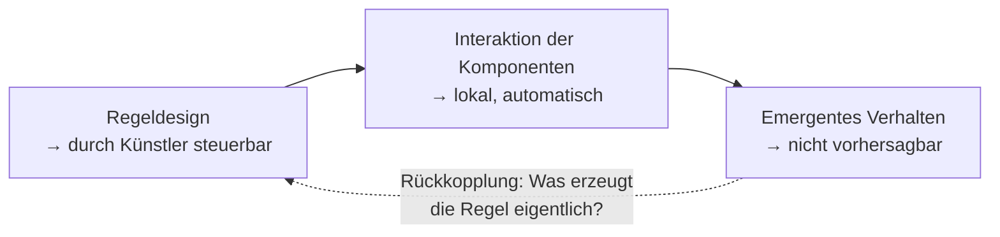

---
tags:
  - theorie
  - algorithmus
  - biologie
  - medienkunst
typ: theorie
bereich: theorie
---

# Emergenz — Das Ganze ist mehr als die Summe

> Eigenschaften oder Verhaltensweisen die nicht aus den Eigenschaften der Einzelteile ableitbar sind — sie entstehen aus der **Interaktion**. Eine Zelle ist lebendig. Ein Neuron denkt nicht. Ein Ameise plant keine Kolonie. Und trotzdem: Leben, Bewusstsein, Kolonie. Emergenz ist das Prinzip hinter allen komplexen Systemen, allen Life Simulations, allem kollektivem Verhalten.

**Verwandte Themen:** [[zellulaere_automaten]] | [[quorum_sensing]] | [[schmetterlings_effekt]] | [[reaktions_diffusion]] | [[bakterielle_vermehrung]] | [[biosemiotik]] | [[artificial_bacteria_konzept]] | [[__cosmicbrain__]]

---

## Definition und Abgrenzung

**Emergenz** (lat. *emergere* = auftauchen): das Entstehen von Eigenschaften auf einer höheren Systemebene die auf der Ebene der Komponenten nicht existieren und nicht vorhergesagt werden können.

### Schwache vs. Starke Emergenz

| | Schwache Emergenz | Starke Emergenz |
|---|---|---|
| Definition | Aus Komponenten prinzipiell herleitbar, aber nur durch Simulation auffindbar | Prinzipiell nicht auf Komponenten reduzierbar |
| Beispiel | Game of Life Glider | Bewusstsein aus Neuronen (strittig) |
| Wissenschaftsstatus | anerkannt | philosophisch umstritten |
| Praktisch | **der relevante Fall für generative Systeme** | relevant für Bewusstseinsforschung |

Für die Praxis: schwache Emergenz ist real und wichtig. Ein Glider in Game of Life ist *emergent* weil kein einzelner Schritt des Algorithmus "Glider" beschreibt — er entsteht aus der Dynamik.

---

## Bedingungen für Emergenz

Nicht alle komplexen Systeme sind emergent. Voraussetzungen:

1. **Viele Komponenten** — nicht eine, nicht zwei
2. **Lokale Interaktion** — Komponenten kennen nur ihre unmittelbare Umgebung
3. **Nicht-lineare Dynamik** — kleine Inputs können große Outputs erzeugen
4. **Keine globale Steuerung** — kein zentrales Element kennt das Ganze

Das ist exakt die Struktur von:
- Bakterienpopulationen ([[quorum_sensing]])
- Zellulären Automaten ([[zellulaere_automaten]])
- Reaktions-Diffusions-Systemen ([[reaktions_diffusion]])
- Neuronalen Netzen
- Märkten, Sprachen, Städten

---

## Emergenz in biologischen Systemen

### Quorum Sensing
Einzelne Bakterienzellen produzieren Signalmoleküle. Kein Bakterium kennt die Gesamtpopulation. Das kollektive Verhalten — Biofilm-Bildung, Virulenz, Biolumineszenz — entsteht emergent aus der Dichte. → [[quorum_sensing]]

### Schwarmverhalten
Einzelne Fische, Vögel, Insekten folgen drei lokalen Regeln:
1. Distanz halten (Abstoßung bei Nähe)
2. Richtung angleichen (Ausrichtung an Nachbarn)
3. Zusammen bleiben (Anziehung bei Distanz)

Ergebnis: kohärente Schwärme mit kollektiver Intelligenz. Kein Anführer. Kein Plan.

### Bewusstsein (stark emergent / strittig)
~86 Milliarden Neuronen, je ~7000 Synapsen. Kein Neuron "denkt". Bewusstsein, Selbstwahrnehmung, Kreativität entstehen — wenn sie entstehen — als emergente Eigenschaften des Netzwerks. Die **Computational Theory of Mind** (schwach) vs. **Qualia-Problem** (stark): ist das ableitbar oder nicht?

---

## Emergenz in Life Simulations

```
Conway's Game of Life:
  Regeln: 3 Zahlen (B3/S23)
  Emergent: Glider, Guns, Oszillatoren, universeller Computer

Lenia:
  Regeln: Faltungskernel + Wachstumsfunktion (5–10 Parameter)
  Emergent: orbiumartige Organismen, Schwärme, Ökosysteme

Reaktions-Diffusion:
  Regeln: 4 Parameter (Du, Dv, F, k)
  Emergent: Leopardenmuster, Labyrinth, Spiralen
```

Die Regel-Emergenz-Lücke: **die Regeln beschreiben nicht was entsteht.** Das Verhalten muss simuliert werden — es kann nicht analytisch hergeleitet werden.

---

## Emergenz und Kontrolle

Das zentrale Spannungsfeld in Kunst und Design mit emergenten Systemen:



**Konsequenz:** Der Künstler ist Regelgeber, nicht Verhaltensdesigner. Das ist entweder Kontrollverlust oder Kontrollübergabe — je nach Perspektive.

Die Frage ob man das System "versteht" verschiebt sich: man kann alle Regeln kennen und das Verhalten trotzdem nicht kennen. Verstehen ≠ Vorhersagen.

---

## Emergenz als politisches Konzept

Emergenz ist das Strukturprinzip nicht-hierarchischer Systeme:

- [[quorum_sensing|Quorum Sensing]]: kollektive Entscheidung ohne Zentrum
- Schwarm: Intelligenz ohne Anführer
- Sprache: Bedeutung ohne Gesetzgeber
- Märkte: Preise ohne Preisfestsetzer

Alle Top-Down-Architekturen (Hierarchie, zentrale Kontrolle, Planung) versuchen emergente Komplexität durch Steuerung zu ersetzen. Das scheitert bei ausreichender Systemgröße an der Informationslage — kein Zentrum kann alle lokalen Zustände kennen.

In der Medienkunst: Systeme die emergent sind, machen ihre eigene nicht-hierarchische Struktur sichtbar.

---

## Summary (EN)

Emergence is the appearance of properties at a system level that are not present in or predictable from the individual components. Weak emergence (in principle simulable from rules, but not analytically derivable) is the relevant case for generative systems — [[zellulaere_automaten|Game of Life]] gliders, [[leopardenmuster|leopard spots]], flocking behaviour. Strong emergence (consciousness) remains philosophically contested. Conditions: many components, local interactions, non-linear dynamics, no global controller. Emergence is both a scientific description and a political model: collective behaviour without hierarchy, intelligence without centre, pattern without designer.
