---
tags:
  - theorie
  - politik
  - sprache
typ: theorie
bereich: theorie
---

# EU Taxonomie — Klassifikation als Machtakt

> Klassifikationssystem der EU das definiert welche Wirtschaftsaktivitäten als "nachhaltig" gelten. Umstritten: fossiles Gas und Atomkraft wurden als grün eingestuft. Sprache als politisches Instrument — wer definiert was grün ist, kontrolliert den Diskurs.

**Verwandte Themen:** [[__cosmicbrain__]] | [[petrochemie]] | [[verantwortungsnetzwerk]] | [[__sandbox__]]

---

## Das System

Die EU-Taxonomieverordnung (2020) legt fest, welche Wirtschaftsaktivitäten als ökologisch nachhaltig klassifiziert werden — und damit für Green Finance, nachhaltige Investitionen und ESG-Ratings qualifizieren.

**Kontroverse:** Im Delegierten Rechtsakt von 2022 wurden fossiles Erdgas und Kernenergie unter bestimmten Bedingungen als "grüne" Investments eingestuft. Widerspruch: Umweltorganisationen, viele EU-Mitgliedsstaaten, Wissenschaftler.

---

## Klassifikation als Gewalt

Das interessante an der EU-Taxonomie ist nicht ob sie richtig oder falsch ist — sondern *wer klassifiziert* und *warum*.

**Klassifikation ist nie neutral.** Sie:
- legt Kategorien fest die andere ausschließen
- bestimmt welche Entitäten sichtbar werden (und welche nicht)
- erzeugt Realität durch Benennung — Performativität der Sprache
- verteilt Ressourcen und Macht durch scheinbar technische Kriterien

Verbindung zu: Biosemiotik — auch biologische Systeme klassifizieren ihre Umwelt. Klassifikation ist das grundlegende kognitive Werkzeug. Die Frage ist immer: wessen Klassifikation gilt?

```mermaid
graph TD
    A[Wirtschaftsaktivität]
    B{EU Taxonomie: grün?}
    C[Zugang zu Green Finance]
    D[Ausschluss aus Green Finance]
    E[Atomkraft / Gas → grün]
    A --> B
    B -->|Ja| C
    B -->|Nein| D
    E -->|Ausnahme by Lobbying| C
    style E fill:#2a1a1a,stroke:#a44
    style C fill:#1a2a1a,stroke:#4a8
```

---

## Medienkünstlerische Perspektive

Wenn Sprache Realität erzeugt: Was ist dann das Äquivalent in technischen Systemen? Datenbanken als Taxonomien. Algorithmen die klassifizieren und damit Realität produzieren. Label-Bias in KI als politische Aussage.

Verbindung zu [[verantwortungsnetzwerk|Verantwortungsnetzwerk]]: Wenn die Taxonomie von einem Komitee beschlossen, von Regulierern umgesetzt und von Märkten angewendet wird — wer ist verantwortlich für ihre Konsequenzen?

---

## Referenzen

- EU Taxonomy Regulation — Technical Expert Group Reports
- → [[__sandbox__#Gesellschaft & Kritik]]

---

## Summary (EN)

The EU Taxonomy defines which economic activities count as sustainable. When fossil gas and nuclear were classified "green," it exposed that classification is never neutral — it distributes power, creates reality through naming, and reflects political negotiation more than scientific consensus. In media art: classification systems (databases, algorithms, labels) as political instruments. Whoever controls the taxonomy controls the narrative.
