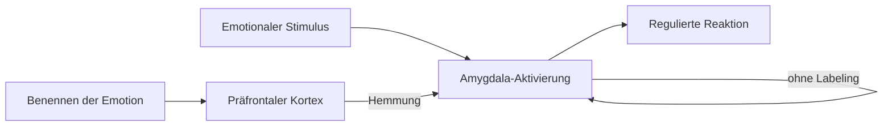

---
tags:
  - theorie
  - psychologie
  - medienkunst
typ: theorie
bereich: theorie
---

# Interoception & Affective Labeling

> Zwei miteinander verwobene Fähigkeiten: **Interoception** ist die Wahrnehmung des eigenen Körperinnenraums — Herzschlag, Hunger, Atemrhythmus, Spannung, Schmerz. **Affective Labeling** ist die Sprache dafür — das präzise Benennen eines Gefühlszustands. Gemeinsam sind sie die Grundlage emotionaler Granularität: wer seinen Körper nicht hören kann, kann ihn nicht beschreiben.

**Verwandte Themen:** [[emotionale_granularitaet]] | [[social_media_emotionale_granularitaet]] | [[biosemiotik]] | [[endosemiotik]] | [[__cosmicbrain__]] | [[__sandbox__]]

---

## Interoception

### Definition

Interoception (lat. *interus* = innen, *capere* = nehmen) bezeichnet die neuronale Verarbeitung von Signalen aus dem Körperinneren. Nicht Propriozeption (Position des Körpers im Raum), nicht Exterozeption (Außenwelt) — sondern der Zustand der inneren Organe, Gefäße, Muskeln.

### Neuronale Pfade

**Vagusnerv (N. vagus)** — Hauptkanal für viszerale Signale:
- trägt ~80% seiner Fasern **afferent** (Körper → Gehirn), nur 20% efferent
- Herz, Lunge, Verdauungstrakt → Hirnstamm → Thalamus → Insula

**Insuärer Kortex (Insula)** — primäre Interoceptionsregion:
- anteriore Insula: emotionale und kognitive Verarbeitung
- posteriore Insula: somatosensorische Verarbeitung
- Aktiviert bei Schmerz, Hunger, sozialem Ausschluss, Empathie

**Zusammenfassung des Pfads:**
```
Körper (Organe, Gefäße, Muskeln)
  ↓ [Vagusnerv + Spinalnerven]
Hirnstamm (Nucleus tractus solitarius)
  ↓
Thalamus
  ↓
Insula + anteriorer cingulärer Kortex
  ↓
Bewusstes Körpergefühl / Emotion
```

### Variabilität

Interoceptive Genauigkeit (*heartbeat detection task*): Individuen unterscheiden sich erheblich darin, wie präzise sie eigene Körpersignale wahrnehmen. Hohe Interoception korreliert mit:
- besserer Emotionsregulation
- höherer emotionaler Granularität
- weniger alexithymischen Symptomen (Kurzschluss zwischen Körper und Sprache)

**Damasio's Somatic Marker Hypothesis:** Entscheidungen sind nicht rein kognitiv. Körpersignale (Bauchgefühl = viszerale Interoception) markieren Optionen mit emotionaler Valenz und steuern so implizit die Wahl.

---

## Affective Labeling

### Definition

Affective Labeling = das bewusste Benennen eines emotionalen Zustands. Klingt banal. Ist neurobiologisch signifikant.

### Der Effekt — Lieberman et al. (2007)

Amygdala-Aktivierung durch emotionale Stimuli **sinkt** wenn Versuchspersonen ihre Emotion in Worte fassen — auch wenn die Wörter stillen, nicht laut gesagt werden. *Affect labeling as implicit emotion regulation.*



Das Benennen aktiviert den präfrontalen Kortex (rationale Verarbeitung) und hemmt dadurch die Amygdala (Stressreaktion). Sprache reguliert Emotion.

### Präzision macht den Unterschied

**"Ich bin aufgeregt"** → unspezifisch → geringe Regulation  
**"Ich bin freudig gespannt auf etwas das ich selbst wähle"** → präzise → stärkerer Regulationseffekt

Das ist das Kernargument der [[emotionale_granularitaet|emotionalen Granularität]]: je mehr Emotional-Vokabular, desto größer die Regulationskapazität.

**Lisa Feldman Barrett** (Theorie der konstruierten Emotion): Emotionen werden nicht *gefunden* — sie werden aus Körpersignalen + Konzepten + Kontext konstruiert. Ohne Konzepte (= Wörter) gibt es keine differenzierte Emotion, nur undifferenzierten Arousal.

---

## Zusammenspiel

```
INTEROCEPTION:    Herz schlägt schneller
KÖRPERSIGNAL:     Enge im Brustkorb, Wärme im Gesicht
LABELING-SCHRITT: "Das ist... Freude? Aufregung? Stolz?"
GRANULARITÄT:     "Stolz auf eine eigene Leistung — warm, aufrecht"
REGULATION:       präzise emotionale Reaktion, nicht blinde
```

Ohne Interoception: der Körper spricht, aber niemand hört.  
Ohne Labeling: der Körper wird gehört, aber nicht verstanden.  
Ohne Granularität: das Verstehen bleibt grob.

---

## Medienkünstlerische Perspektive

Interoception ist das Interface zwischen Körper und Bewusstsein — und kann zum künstlerischen Material werden.

**Anwendungsrichtungen:**
- Herzschlag, Atemrhythmus, Hautleitfähigkeit als Systemsteuerung — der Körperzustand als Controller
- Biofeedback-Installationen die Interoception sichtbar machen und Labeling erzwingen
- Gegen [[social_media_emotionale_granularitaet|Social Media]]-Logik: ein Interface das verlangsamt, benennt, differenziert statt zu klicken

**Politische Dimension:** Systeme die Interoception ersetzen oder überblenden (Screens als Außenwahrnehmung, Tempo als verhinderte Innenwahrnehmung) schwächen die emotionale Selbstregulation. Das ist kein Kollateralschaden — es ist Funktion.

---

## Summary (EN)

Interoception is the neural sensing of the body's internal state — cardiac, respiratory, visceral signals processed primarily via the vagus nerve and insula. Affective labeling is the act of putting emotional states into words; it reduces amygdala activation through prefrontal inhibition (Lieberman, 2007). Together they form the basis of emotional granularity: without body-sensing, no emotional signal; without labeling, no differentiation; without differentiation, no regulation. Media art application: body-state as interface material, slow systems that demand naming over clicking.
