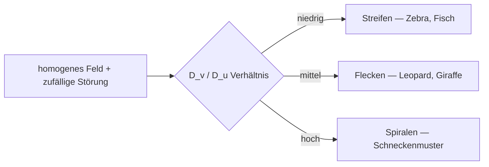

---
tags:
  - theorie
  - algorithmus
  - biologie
  - emergenz
  - medienkunst
typ: theorie
bereich: theorie
---

# Leopardenmuster als Algorithmus — Turing-Morphogenese

> Das Leopardenmuster ist keine biologische Verschönerung — es ist die Lösung einer partiellen Differentialgleichung auf einem Körper. Alan Turing zeigte 1952 wie einfache chemische Reaktionen und Diffusion aus homogenem Gewebe stabile, biologisch realistische Muster erzeugen. Schönheit als mathematische Konsequenz.

**Verwandte Themen:** [[alan_turing]] | [[reaktions_diffusion]] | [[bakterielle_vermehrung]] | [[zellulaere_automaten]] | [[artificial_bacteria_konzept]] | [[biosemiotik]] | [[__cosmicbrain__]]

---

## Das Prinzip: [[reaktions_diffusion|Aktivator / Inhibitor]]

Zwei Chemikalien diffundieren durch ein Gewebe:

| | Aktivator $u$ | Inhibitor $v$ |
|---|---|---|
| Eigenproduktion | fördert sich selbst | hemmt Aktivator |
| Diffusion | **langsam** | **schnell** |
| Wirkungsradius | lokal | weitreichend |

Wo Aktivator entsteht, verstärkt er sich — aber der schneller diffundierende Inhibitor dämpft ihn auf Distanz. Lokal hohe Konzentration + weitreichende Unterdrückung = stabiles Muster.

$$\frac{\partial u}{\partial t} = D_u \nabla^2 u + f(u,v)$$
$$\frac{\partial v}{\partial t} = D_v \nabla^2 v + g(u,v)$$

Das Verhältnis $D_v / D_u$ bestimmt die Mustergröße und -form.

---

## Was das Modell erzeugt

Biologisch bestätigt für:
- Fell von Leopard, Gepard, Giraffe, Jaguar
- Zebrafisch-Streifen (Nakamura et al., 2014: direkte experimentelle Bestätigung)
- Fingerabdrücke
- Herzrhythmus-Wellen (arrhythmische Spiralmuster)
- Körpermuster der Tintenfische und Weichtiere

---

## Vom Muster zur Simulation

Das Leopardenmuster und die Life Simulations sind Geschwister aus verschiedenen Jahrzehnten:

| Leopardenmuster (Turing 1952) | [[zellulaere_automaten|Game of Life]] (Conway 1970) | Lenia (Chan 2019) |
|---|---|---|
| Partielle Differentialgleichung | Diskrete Zellregel | Faltungskernel |
| Kontinuierliches Feld | Binäres Raster | Kontinuierliches Feld |
| Aktivator/Inhibitor-Chemie | Nachbarzählung | Wachstumsfunktion |
| Räumliche Diffusion | Zeitliche Ticks | Beide |
| Biologische Muster | Glider, Oszillatoren | Lebensähnliche Strukturen |

Lenia ist im Kern ein zeitdiskretes [[reaktions_diffusion|Reaktions-Diffusions-System]] — der Faltungskernel entspricht dem Diffusionsoperator $\nabla^2$.

---

## Gray-Scott Model

Die bekannteste Implementierung für Kunst und Simulation. Zwei Reaktionen:

$$u + 2v \rightarrow 3v \quad \text{(Autokatalyse)}$$
$$v \rightarrow P \quad \text{(Abbau)}$$

Parameter $F$ (Feed-Rate) und $k$ (Kill-Rate) erzeugen verschiedene Regime:

| F | k | Muster |
|---|---|---|
| niedrig | niedrig | Einzelne ruhige Flecken |
| mittel | mittel | Labyrinth, Worms |
| hoch | mittel | Coral, Mitosis |
| hoch | hoch | Streifen |

Karl Sims' **Pearson-Parametermap** zeigt den vollständigen Parameterraum als Karte — eine Taxonomie aller möglichen Muster in einem 2D-Diagramm.

→ [[zellulaere_automaten]] | [[reaktions_diffusion]]

---

## Medienkünstlerische Perspektive

Das Leopardenmuster beantwortet die Frage ob Natur algorithmisch ist mit: **ja, immer schon.**

Schönheit als Nebenprodukt von Physik. Das Muster hat keinen Zweck — es entsteht weil die Differentialgleichung es erzeugt. Das ist entweder tröstlich oder erschreckend, je nach Blickwinkel. Es bedeutet auch: der Algorithmus war vor der Ästhetik. Leben programmiert seine eigene Oberfläche.

**Für das Werk:** Gray-Scott in einem pH-reaktiven Medium → das Muster entsteht physisch, nicht digital. Reaktions-Diffusion als chemische Installation. Das Leopardenmuster das sich selbst malt.

---

## Summary (EN)

Turing's 1952 morphogenesis paper proved that the interaction of two diffusing chemicals — an activator (self-reinforcing, slow) and an inhibitor (suppressing, fast) — generates stable biological patterns from noise: stripes, spots, spirals. The leopard's spots are not designed; they are the solution to a PDE solved on developing skin. This principle directly inspired reaction-diffusion art (Gray-Scott model, Karl Sims), continuous life simulations (Lenia), and shows that nature has always been algorithmic. Beauty is a side effect of chemistry.
