---
tags:
  - theorie
  - material
  - politik
typ: theorie
bereich: theorie
---

# Petrochemie — Fossile Energie als geronnene biologische Zeit

> Chemische Industrie basierend auf Erdöl und Erdgas. Fossile Energie ist Millionen Jahre verdichtete biologische Zeit — Plastik, Benzin, Kunstharze, Farben tragen die Geschichte ihrer Entstehung. Das Material ist nicht neutral.

**Verwandte Themen:** [[__cosmicbrain__]] | [[kalziumkarbonat]] | [[eu_taxonomie]] | [[anabolismus_katabolismus]] | [[__sandbox__]]

---

## Material als Zeitträger

Fossile Brennstoffe sind keine abstrakten Energiequellen — sie sind biologisches Material das über Millionen Jahre durch Druck, Wärme und geologische Prozesse verdichtet wurde. Phytoplankton, Pflanzen, Tiere — deren organische Substanz wurde zu Erdöl, Erdgas, Kohle.

**Was das bedeutet:**
- Plastik ist totes Leben in anderer Form
- Benzin ist geronnene Fotosynthese
- Jeder Kunststoff trägt die biologische Geschichte seiner Entstehung

---

## Gegenmodell: Biofabrikation

Im Kontrast zu Petrochemie: [[kalziumkarbonat|Kalziumkarbonat]], Bioplastik, Myzel-Materialien — Werkstoffe die von lebenden Organismen *jetzt* produziert werden. Nicht Millionen Jahre komprimierte Zeit, sondern aktiver gegenwärtiger Stoffwechsel.

```mermaid
graph LR
    A[Biologisches Leben — vor Millionen Jahren]
    B[Fossilisierung — Druck, Zeit, Wärme]
    C[Erdöl / Erdgas]
    D[Petrochemie — Plastik, Benzin, Kunstharze]
    E[Gegenmodell: Biofabrikation — lebend produziertes Material]
    A --> B --> C --> D
    A -->|lebende Organismen heute| E
    style C fill:#2a1a0a,stroke:#a64
    style E fill:#1a3a1a,stroke:#4a8
```

---

## Medienkünstlerische Perspektive

Das Material einer Arbeit ist nie neutral. Wenn Medienkunst mit petrochemischen Materialien arbeitet (Bildschirme, Kabel, Platinen, Kunststoffgehäuse), trägt sie die Geschichte dieser Stoffe mit sich.

**Fragen für die künstlerische Praxis:**
- Was ist das Material dieser Arbeit und woher kommt es?
- Ist Unbeständigkeit (biologisch abbaubare Materialien) eine ästhetische und politische Aussage?
- Können Werke mit biologisch produzierten Materialien gemacht werden?

Verbindung zu [[__sandbox__]]: *Früher Marmor für die Ewigkeit — heute wandelbare, abbaubare, wiederverwendbare Materialien. Vergänglichkeit als neue Permanenz.*

---

## Referenzen

- → [[__sandbox__#Biologie als Medientheorie]]
- → [[eu_taxonomie]] — politische Klassifikation fossiler Energie als "grün"

---

## Summary (EN)

Petrochemistry produces materials from fossil fuels — compressed biological life from millions of years ago. Plastic is dead life in another form. In media art: materials are never neutral, they carry the history of their production. Against this: biofabrication — materials grown by living organisms now. Impermanence as aesthetic and political choice.
