---
tags:
  - theorie
  - algorithmus
  - biologie
  - medienkunst
typ: theorie
bereich: theorie
---

# Reaktions-Diffusion — Muster aus Wechselwirkung

> Zwei Substanzen, zwei Prozesse: Reaktion (lokale Wechselwirkung) + Diffusion (räumliche Ausbreitung). Aus ihrer Asymmetrie entstehen Muster — Streifen, Flecken, Spiralen, Labyrinth. Das Leopardenmuster ist eine Lösung. Das Herzrhythmus-Spiralmuster ist eine andere. Dasselbe Prinzip.

**Verwandte Themen:** [[leopardenmuster]] | [[alan_turing]] | [[zellulaere_automaten]] | [[bakterielle_vermehrung]] | [[biosemiotik]] | [[__cosmicbrain__]]

---

## Das Grundprinzip

Ein Reaktions-Diffusions-System (RD-System) beschreibt wie eine oder mehrere Substanzen in einem Medium **reagieren** (chemisch wechselwirken) und gleichzeitig **diffundieren** (sich räumlich ausbreiten). Die allgemeine Gleichung:

$$\frac{\partial \mathbf{c}}{\partial t} = \mathbf{D} \nabla^2 \mathbf{c} + \mathbf{R}(\mathbf{c})$$

wobei:
- $\mathbf{c}$ = Konzentrationsvektor der Substanzen
- $\mathbf{D}$ = Diffusionsmatrix (unterschiedliche Diffusionsraten)
- $\nabla^2$ = Laplace-Operator (räumliche Ausbreitung)
- $\mathbf{R}(\mathbf{c})$ = Reaktionsfunktion (lokale Wechselwirkung)

---

## Aktivator und Inhibitor

Das einfachste musterzeugende RD-System hat **zwei Substanzen**:

### Aktivator $u$
- Produziert sich selbst (positive Rückkopplung)
- Produziert auch den Inhibitor
- **Diffundiert langsam** — bleibt lokal

### Inhibitor $v$  
- Hemmt den Aktivator
- **Diffundiert schnell** — wirkt weitreichend

```mermaid
graph LR
    A[Aktivator u]
    V[Inhibitor v]
    A -->|"+"|A
    A -->|"erzeugt"|V
    V -->|"hemmt"|A
    style A fill:#1a3a1a,stroke:#4a8
    style V fill:#3a1a1a,stroke:#a44
```

**Die entscheidende Asymmetrie:** Aktivator verstärkt sich lokal. Inhibitor dämpft über größere Distanz. Lokale Aktivierung + weitreichende Hemmung = **Turing-Instabilität** = Muster aus Homogenität.

$$\frac{\partial u}{\partial t} = D_u \nabla^2 u + f(u,v)$$
$$\frac{\partial v}{\partial t} = D_v \nabla^2 v + g(u,v)$$

Mit $D_v \gg D_u$ (Inhibitor diffundiert viel schneller als Aktivator) → Muster entstehen.

---

## Was das Verhältnis $D_v / D_u$ bestimmt

Das Verhältnis der Diffusionsraten bestimmt die Raumfrequenz des Musters — den "Zoom-Level":

| $D_v / D_u$ | Muster | Biologisches Beispiel |
|---|---|---|
| klein (~2) | Große, diffuse Bereiche | Umrisse, Farbfelder |
| mittel (~5–10) | Flecken | Leopard, Giraffe |
| groß (~20–50) | Streifen | Zebra, Fisch |
| sehr groß | Labyrinth / feine Strukturen | Fingerabdruck |

---

## Das Gray-Scott-Modell

Die bekannteste Implementierung für visuelle Experimente (Pearson, 1993):

$$\frac{\partial u}{\partial t} = D_u \nabla^2 u - uv^2 + F(1-u)$$
$$\frac{\partial v}{\partial t} = D_v \nabla^2 v + uv^2 - (F+k)v$$

- $u$ = Substrat (wird verbraucht)
- $v$ = Produkt (autokatalytisch)
- $F$ = Feed-Rate (Substrat-Nachschub)
- $k$ = Kill-Rate (Produkt-Abbau)

**Parameterraum — Karl Sims / Pearson-Karte:**

| F (niedrig→hoch) | k (niedrig→hoch) | Muster |
|---|---|---|
| 0.01–0.03 | 0.04–0.06 | Spots, Mitosis-Teilung |
| 0.02–0.04 | 0.05–0.07 | Worms, bewegliche Tentakel |
| 0.03–0.06 | 0.06–0.07 | Labyrinth |
| 0.05–0.08 | 0.06–0.065 | Coral, stabile Skelettstruktur |
| 0.03–0.06 | 0.058–0.066 | Streifen |

→ Interactive simulator: [mrob.com/pub/comp/xmorphia/](https://mrob.com/pub/comp/xmorphia/)

---

## Biologische Vorkommen

RD-Prinzip beobachtet in:
- **Fellmuster** (Leopard, Gepard, Jaguar, Giraffe, Zebrafisch — direkt bestätigt)
- **Fingerabdrücke** — Ridgemuster als RD-Muster auf Fingerbeerenepidermis
- **Herzrhythmus** — Spiral-Reentry als pathologischer Aktivator-Loop (Kammerflimmern)
- **Korallenwachstum** — Verzweigungsmuster
- **Striatum-Neuronen** — patchy connections durch RD-ähnliche Prozesse
- **Schneckenmuster** — Conus textile als Gray-Scott-ähnlicher Parameter
- **Chemische Wellen** — Belousov-Zhabotinsky-Reaktion (experimentell sichtbarer RD-Prozess)

---

## Belousov-Zhabotinsky (BZ) — RD sichtbar gemacht

Die BZ-Reaktion ist der direkte chemische Beweis: Brom-basierte Oxidations-Reduktions-Reaktion in einem Petrifilm erzeugt spontan konzentrische Spiralen und Wellen — sichtbar mit bloßem Auge, ohne biologisches System.

Das Petrisystem *ist* ein Reaktions-Diffusions-System. Die Schönheit ist Chemie.

---

## Von der Chemie zur Simulation — Beziehung zu Lenia

[[bakterielle_vermehrung#5 — Überleitung: Von der Zelle zur Simulation|Lenia]] (Chan, 2019) ist ein kontinuierlicher zellulärer Automat — und gleichzeitig ein zeitdiskretes RD-System. Der Faltungskernel entspricht dem Laplace-Operator $\nabla^2$, die Wachstumsfunktion entspricht $R(\mathbf{c})$. Die lebensartigen Strukturen in Lenia *sind* RD-Muster auf einem abstrakten Substrat.

---

## Medienkünstlerische Perspektive

RD-Systeme stellen die schärfste Frage der generativen Kunst: **Wer ist Autor?** Der Künstler setzt $F$, $k$ und $D_v/D_u$. Das Muster entsteht aus der Physik des Systems — aus dem Prinzip, nicht aus dem Plan. Schönheit als mathematische Konsequenz.

Das Muster ist nicht designed. Es ist gelöst.

**Für das Werk:** Gray-Scott in einem pH-reaktiven Medium → das Muster entsteht physisch, nicht digital. Das Leopardenmuster das sich selbst malt. → [[leopardenmuster#Medienkünstlerische Perspektive]]

---

## Summary (EN)

Reaction-diffusion systems generate spatial patterns from the interaction of two processes: local chemical reactions and spatial diffusion. When an activator (self-amplifying, slow diffusion) and an inhibitor (suppressing, fast diffusion) interact, Turing instability produces stable spatial patterns — stripes, spots, spirals — from an initially homogeneous field. First described mathematically by Turing (1952); experimentally confirmed for leopard spots (Nakamura, 2014) and visible in the Belousov-Zhabotinsky reaction. The Gray-Scott model (Pearson, 1993) is the canonical computational implementation. Lenia is a RD system on an abstract substrate.
