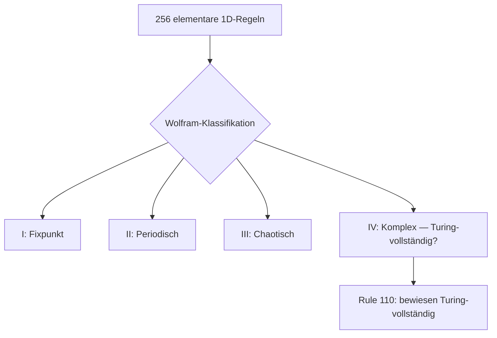

# Stephen Wolfram — Zelluläre Automaten und eine neue Wissenschaft

> Britisch-amerikanischer Informatiker, Physiker und Mathematiker (* 1959). Schuf Mathematica, Wolfram|Alpha und *A New Kind of Science* (2002) — das Argument dass einfache Berechnungsregeln ein besseres Modell der Natur liefern als klassische Mathematik. Wolframs These: das Universum rechnet.

**Verwandte Themen:** [[zellulaere_automaten]] | [[alan_turing]] | [[reaktions_diffusion]] | [[emergenz]] | [[leopardenmuster]] | [[schmetterlings_effekt]]

---

## Biografie (Kurzfassung)

- *1959* geboren in London
- Physik Oxford, PhD Caltech mit 20 Jahren (Teilchenphysik)
- *1980er*: Pionierarbeit an zellulären Automaten — Wolfram-Klassifikation
- *1988*: Gründung Wolfram Research, Entwicklung von *Mathematica*
- *2002*: *A New Kind of Science* — 1.200 Seiten, kein Peer Review, maximale Geste
- *2009*: Wolfram|Alpha — computational knowledge engine
- *2020*: Wolfram Physics Project — das Universum als wachsender Hypergraph

---

## Wolfram-Klassifikation Zellulärer Automaten

Wolfram klassifiziert alle 256 elementaren 1D-Automaten (2 Zustände, 3 Nachbarn, 8 Regelkombinationen) in vier Klassen:

| Klasse | Verhalten | Analogie |
|--------|-----------|----------|
| I | Alle Zellen konvergieren → Fixpunkt | Kristall, Stasis |
| II | Periodische / stabile lokale Strukturen | Blinker, Oszillatoren |
| III | Chaotisch, pseudozufällig | Rauschen, kein Muster |
| IV | Komplexe persistente Strukturen, Lokalität | Glider, Game of Life |

**Klasse IV** ist der Schlüssel: hier entstehen Strukturen die gleichzeitig stabil und komplex sind — Wolframs Kandidat für die Grundlage universeller Berechnung in der Natur.

**Rule 110**: Der einzige elementare Automat der als Turing-vollständig bewiesen wurde (Matthew Cook, 1994). Aus acht Regeln entsteht universelle Berechnung.

---

## *A New Kind of Science* — Kernthese

> „The universe is computational."

Wolframs Argument in drei Schritten:

1. **Computational equivalence**: Fast alle nicht-trivial einfachen Systeme sind gleich berechnungsstark — und damit gleich komplex. Es gibt keine Hierarchie der Komplexität, nur eine Schwelle zwischen trivial und nicht-trivial.

2. **Irreducibility**: Manche Systeme können nicht durch Gleichungen abgekürzt werden — das Verhalten kann nur durch direktes Ausführen ermittelt werden. Keine Formel *berechnet* den Ausgang, nur die Simulation selbst.

3. **Simple programs, complex outputs**: Natur ist besser als Differentialgleichungssystem beschreibbar durch einfache lokale Regeln. Tiermuster, Schneeflocken, Turbulenz, Gehirn — alles Klasse-IV-Systeme?

**Kontroverse**: Wolframs Beanspruchung war radikal und die wissenschaftliche Gemeinschaft reagierte gespalten — viele Ideen existierten bereits (zB Turing 1952, Holland, Langton), aber die Synthese und die Geste — ein Einzelautor, kein Peer Review — polarisierte.

---

## Verbindung zu Alan Turing

Turing und Wolfram arbeiten auf ähnlichem Terrain aus verschiedenen Richtungen:

| Turing (1952) | Wolfram (1986–2002) |
|---------------|---------------------|
| [[reaktions_diffusion|Reaktions-Diffusion]] → biologische Muster | 1D-Automaten → alle Muster |
| Chemie als Berechnung | Berechnung als Physik |
| Morphogenese als Algorithmus | Universum als Algorithmus |
| Turing-Maschine als abstrakte Grenze | Rule 110 als realisierte Grenze |

Beide: Natur als formaler Prozess, Biologie als Algorithmus, Schönheit als Nebenprodukt von Regeln.

→ [[turing_land_duchamp_land]]: Wolfram ist tief im Turing-Land — Funktion und Regel als Essenz.

---

## Wolfram Physics Project (2020)

Das Universum als wachsender **Hypergraph** dessen Evolution durch minimale Umschreibregeln bestimmt wird. Raum, Zeit, Quantenmechanik und Gravitation sollen aus diesen Regeln emergieren.

Status: spekulativ, mathematisch präzise formuliert, wissenschaftlich umstritten. Aber die Geste ist konsequent: was Wolfram 2002 für Muster behauptete, beansprucht er 2020 für die Physik insgesamt.

---

## Medienkünstlerischer Kontext

Wolframs Programm ist eine radikale **Ästhetisierung des Algorithmischen**: wenn das Universum rechnet, ist jedes berechnende System ein Spiegel der Wirklichkeit — kein Modell, sondern Teilnahme.

[[zellulaere_automaten|Zelluläre Automaten]] als Kunstform: nicht Simulation *von* Natur, sondern Realisierung *derselben Regeln*. Rule 110 im Code und Rule 110 im Biofilm — dasselbe?

*A New Kind of Science* als **Medienprojekt**: ein Buch das sich selbst als Paradigmenwechsel inszeniert. Kein Peer Review, maximale Geste, ein Autor. Das Buch als Readymade einer wissenschaftlichen Revolution — [[marcel_duchamp|Duchamp]] würde das verstehen.

→ [[artificial_bacteria_konzept]]: das Installationskonzept ist ein metabolischer zellulärer Automat — Wolframs Klasse IV in physischer, nasser Materie.

---

## Summary (EN)

Stephen Wolfram (b. 1959) is a British-American computer scientist and physicist. He developed the Wolfram classification of cellular automata (Classes I–IV), created Mathematica (1988) and Wolfram|Alpha (2009), and published *A New Kind of Science* (2002) — arguing that simple computational rules describe natural phenomena better than traditional mathematics. Central thesis: the universe is computational, almost all non-trivial systems are computationally equivalent. His work on Rule 110 (Turing-complete elementary automaton) connects directly to Turing's morphogenesis and informs the aesthetics of generative, algorithmic, and systems-based art.
