---
tags:
  - theorie
  - ki
  - medienkunst
typ: theorie
bereich: theorie
---

# Turing Land vs. Duchamp Land — Zwei Pole des Denkens über Intelligenz

> Zwei polare Denkweisen über Intelligenz und Bedeutung. Turing: Intelligenz ist Funktion — wenn es sich wie Intelligenz verhält, ist es Intelligenz. Duchamp: Bedeutung entsteht durch Kontext, nicht Funktion. KI-Kunst bewegt sich zwischen diesen Polen.

**Verwandte Themen:** [[__cosmicbrain__]] | [[pataphysik]] | [[verantwortungsnetzwerk]] | [[artificial_bacteria_konzept]] | [[__sandbox__]] | [[projects/esp_ai_art/README.md]]

---

## Turing Land

Alan Turing fragt in *Computing Machinery and Intelligence* (1950): **"Can machines think?"** — und ersetzt diese Frage durch einen operationalen Test. Wenn eine Maschine im Gespräch nicht von einem Menschen zu unterscheiden ist, gilt sie als intelligent.

**Kernprinzip:** Intelligenz ist Funktion. Was sich intelligent verhält, ist intelligent. Das Innere — Bewusstsein, Gefühl, Substrat — ist irrelevant. Nur die Ausgabe zählt.

Konsequenz für Kunst: Wenn ein KI-System Kunst *erzeugt* die wie Kunst aussieht — ist es dann Kunst?

---

## Duchamp Land

Marcel Duchamp bricht mit der formalen Ästhetik durch das **Readymade** (1913–): ein industriell gefertigtes Urinal ins Museum stellen und es *Fountain* nennen. Nicht Form, nicht Handwerk, nicht Material entscheiden — sondern Kontext und Konzept.

**Kernprinzip:** Bedeutung entsteht durch Kontext, nicht durch Funktion oder Form. Das *was* es ist spielt weniger eine Rolle als *warum* und *wo* es steht.

Konsequenz für Kunst: Eine KI die Bilder ausgibt ist nicht automatisch Künstler — aber eine KI die in einen konzeptuellen Kontext gesetzt wird, kann es werden.

---

## Die Spannung

```mermaid
graph LR
    T[Turing Land\nFunktion = Intelligenz\nAusgabe = Maßstab]
    D[Duchamp Land\nKontext = Bedeutung\nKonzept = Maßstab]
    KI[KI in der Kunst]
    T --> KI
    D --> KI
    KI --> F[Wer definiert was das Werk ist?]
    style T fill:#1a1a3a,stroke:#44f
    style D fill:#3a1a1a,stroke:#f44
    style KI fill:#2a2a2a,stroke:#888
```

---

## Medienkünstlerische Perspektive

KI-Kunst bewegt sich permanent zwischen diesen Polen. Die meisten kommerziellen KI-Tools operieren in Turing Land: sie optimieren für Funktion, für Überzeugungskraft, für Ähnlichkeit. Konzeptuelle KI-Kunst fragt stattdessen: Was ist der Kontext? Für wen? Warum?

Verbindung zu [[pataphysik|Pataphysik]]: Pataphysik wäre der dritte Pol — jenseits von Funktion *und* Kontext. Das Absurde as Methode.

---

## Referenzen

- Alan Turing — *Computing Machinery and Intelligence* (1950) → [[literatur]]
- Marcel Duchamp — *Fountain* (1917)
- → [[__sandbox__#Algorithmus & Maschine — offene Fragen]]

---

## Summary (EN)

Two poles for thinking about intelligence and meaning in art and AI. Turing Land: intelligence is functional — if it behaves like intelligence, it is intelligence. Duchamp Land: meaning is contextual — an object becomes art through placement and concept, not function. Most AI operates in Turing Land. Conceptual AI art asks Duchamp Land questions: not what does it output, but what does it mean and for whom.
