---
tags:
  - theorie
  - ki
  - ethik
typ: theorie
bereich: theorie
---

# Verantwortungsnetzwerk — Verteilte Verantwortung in technischen Systemen

> Verantwortung nicht als Eigenschaft eines einzelnen Akteurs, sondern als verteilte Struktur im Gefüge von Mensch, Algorithmus, Institution und Infrastruktur. Wenn niemand allein verantwortlich ist — wer ist es dann?

**Verwandte Themen:** [[__cosmicbrain__]] | [[turing_land_duchamp_land]] | [[eu_taxonomie]] | [[__sandbox__]] | [[projects/esp_ai_art/README.md]]

---

## Das Problem der verteilten Verantwortung

Klassische Verantwortungsethik setzt einen Akteur voraus: eine Person die entscheidet, handelt und für die Konsequenzen einsteht. In technischen Systemen — besonders in KI-Systemen — ist Verantwortung auf viele Akteure verteilt:

- **Entwickler** — schreiben den Code, wählen das Modell
- **Trainingsdaten-Produzenten** — liefern implizite Werte und Biases  
- **Unternehmen** — entscheiden über Deployment und Anwendungsbereich
- **Algorithmus** — trifft Entscheidungen nach erlernten Mustern
- **Nutzer** — handeln auf Basis der Ausgaben
- **Institution/Infrastruktur** — reguliert oder nicht, ermöglicht oder verhindert

Wenn ein KI-System diskriminiert, einschüchtert, Schaden verursacht: Wer ist verantwortlich?

---

## Moral Agency vs. Verantwortungsnetzwerk

→ [[__cosmicbrain__#M|Moral Agency]] fragt: *Hat die Maschine moralische Handlungsfähigkeit?*  
Verantwortungsnetzwerk fragt: *Wie ist Verantwortung im Gesamtgefüge verteilt?*

Letzteres ist pragmatisch nützlicher: Es geht nicht darum, ob der Algorithmus moralisch urteilen *kann* — sondern darum, wie Verantwortung strukturell zugewiesen und übernommen werden muss.

```mermaid
graph TD
    E[Entwickler:in]
    D[Trainingsdaten]
    U[Unternehmen]
    A[Algorithmus / Modell]
    N[Nutzer:in]
    I[Institution / Regulierung]
    S[Schaden / Entscheidung]
    E --> A
    D --> A
    U --> A
    A --> S
    N --> S
    I -->|ermöglicht / verhindert| S
    style S fill:#3a1a1a,stroke:#a44
    style A fill:#2a2a2a,stroke:#888
```

---

## Medienkünstlerische Perspektive

Wenn ein Kunstwerk mit KI arbeitet: Wer ist Autor? Wer ist verantwortlich für das was es produziert? Das Verantwortungsnetzwerk macht sichtbar, dass Autorschaft in technischen Systemen immer schon kollektiv und verteilt war.

Verbindung zu [[eu_taxonomie|EU Taxonomie]]: Wenn niemand allein für die Konsequenzen der Taxonomie verantwortlich ist (Komitee, Lobbyisten, Regulierer, Märkte) — reproduziert sich die Struktur des Verantwortungsnetzwerks.

---

## Referenzen

- Lucy Suchman — *Human-Machine Reconfigurations*
- Langdon Winner — *Do Artifacts Have Politics?*
- → [[__sandbox__#Technologie & Moral Agency]]

---

## Summary (EN)

Responsibility in AI systems is not the property of a single actor but a distributed structure across developers, training data, institutions, algorithms, and users. "Responsibility networks" ask not whether a machine can bear moral agency, but how responsibility is structurally distributed and how it can be claimed. In art: who is the author when a work is produced by an AI trained on millions of human outputs?
