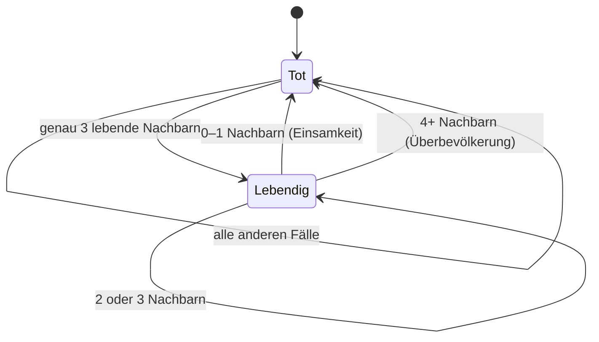
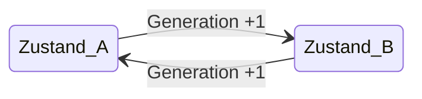
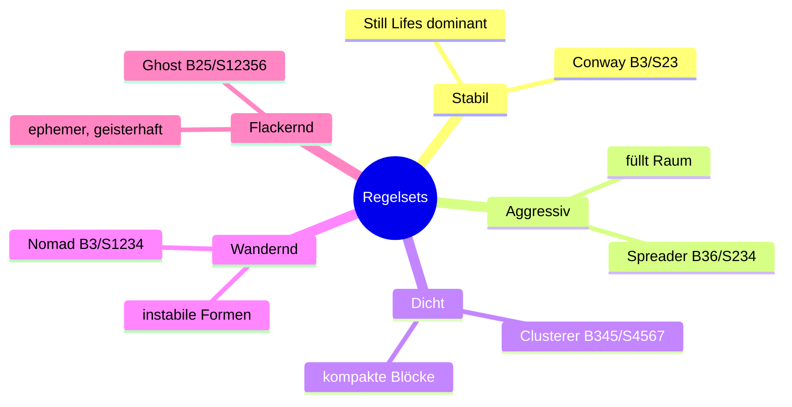
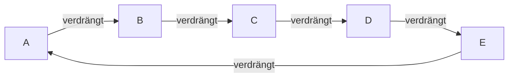

---
tags:
  - theorie
  - algorithmus
  - emergenz
  - ki
typ: theorie
bereich: ki
---

# Zelluläre Automaten — Emergenz aus einfachen Regeln

> Ein zellulärer Automat ist ein Gitter aus Zellen. Jede Zelle hat einen Zustand. Jede Generation berechnet jede Zelle ihren nächsten Zustand — ausschließlich basierend auf sich selbst und ihren direkten Nachbarn. Keine Zelle weiß was das Ganze tut. Und trotzdem entsteht Komplexität.

**Verwandte Konzepte:** [[emergenz]] | [[quorum_sensing]] | [[biosemiotik]] | [[artificial_bacteria_konzept]] | [[biomodalitaet]] | [[bakterielle_vermehrung]] | [[reaktions_diffusion]] | [[schmetterlings_effekt]] | [[turing_land_duchamp_land]] | [[pataphysik]]

---

## Grundprinzip

Das Gitter: ein rechteckiges Raster aus Zellen, jede entweder **lebendig (1)** oder **tot (0)**.

Jede Generation läuft folgender Prozess **gleichzeitig für alle Zellen** ab:

1. Zähle die lebenden Nachbarn (in alle 8 Richtungen)
2. Wende die Regel an
3. Ergebnis ist die nächste Generation

Kein Gedächtnis über mehr als eine Generation. Keine globale Sicht. Keine Steuerung.

---

## Conway's Game of Life — die drei Regeln

John Horton Conway, 1970. Die einfachstmögliche Regel die nicht-triviales Verhalten erzeugt:

| Situation | Regel |
|:--|:--|
| Lebende Zelle, 0–1 Nachbarn | **stirbt** — Einsamkeit |
| Lebende Zelle, 2–3 Nachbarn | **überlebt** |
| Lebende Zelle, 4+ Nachbarn | **stirbt** — Überbevölkerung |
| Tote Zelle, genau 3 Nachbarn | **wird lebendig** — Geburt |
| Tote Zelle, alle anderen | **bleibt tot** |

Drei Zahlen: `B3/S23` — *Birth bei 3 Nachbarn, Survival bei 2 oder 3.* Das ist die vollständige Spezifikation.

### B/S-Notation — die Sprache der Regelsets

Das **B/S-Format** (Golly-Standard) beschreibt jedes 2-Zustands-Zellautomat-Regelset kompakt:

- **B** = Birth: bei welchen Nachbar-Zählungen entsteht eine neue Zelle
- **S** = Survival: bei welchen Nachbar-Zählungen überlebt eine Zelle

Mögliche Werte für B und S: 0–8 (0 bis 8 lebende Nachbarn in der Moore-Nachbarschaft).

Conway `B3/S23`: Geburt bei 3, Überleben bei 2 oder 3. 5 Bit Information → Turing-Vollständigkeit.

**Andere charakteristische Regelsets:**
| Regelset | Name | Charakter |
|---|---|---|
| `B3/S23` | Conway's Life | Balance, Turing-vollständig |
| `B36/S23` | HighLife | wie Life, aber selbstreproduzierenде Strukturen |
| `B2/S` | Seeds | explodiert, kein Überleben — nur Geburt |
| `B1357/S1357` | Replicator | alles repliziert sich |
| `B3678/S34678` | Day & Night | symmetrisch: lebendig ↔ tot austauschbar |
| `B2/S2345` | Life without Death | Zellen sterben nie, wächst unbegrenzt |
| `B3/S012345678` | Immortal | alles überlebt, Geburt normal |

→ [[schmetterlings_effekt]]: minimale Regeländerung (eine Zahl) → vollständig andere emergente Dynamik

---

## Zustands-Diagramm einer Zelle



---

## Strukturklassen — was aus den Regeln entsteht

Aus drei Regeln entstehen vier fundamentale Strukturtypen:

### Still Life — Stabilität
Objekte die sich nicht verändern. Jede lebende Zelle hat genau 2–3 lebende Nachbarn. Keine tote Randzelle hat genau 3.

```
□ □ □ □ □
□ ■ ■ □ □     ← 2×2 Block: jede Zelle hat genau 3 Nachbarn
□ ■ ■ □ □       → überlebt ewig, nichts ändert sich
□ □ □ □ □
```

**Medienkünstlerisch:** Gleichgewicht als Zustand — nicht Stillstand, sondern perfekt ausbalancierte Spannung.

### Oszillator — Rhythmus
Strukturen die zwischen zwei oder mehr Zuständen wechseln. Der Blinker (3 horizontale Zellen) wechselt jede Generation zwischen horizontal und vertikal.



*Pulsar: Periode 3. Es gibt Oszillatoren mit Periode 1.000+.*

**Medienkünstlerisch:** Systeme die leben ohne sich fortzubewegen. Puls ohne Reise.

### Spaceship — Bewegung
Strukturen die sich durch das Gitter *bewegen* — nicht wirklich, sondern durch zyklisches Erscheinen und Verschwinden an versetzten Positionen. Der Glider bewegt sich diagonal: 4 Generationen = 1 Schritt. Er ist nicht dieselbe Struktur die reist — er ist eine Folge von Zuständen die *wie* Bewegung aussieht.

**Medienkünstlerisch:** Identität als Prozess, nicht als Substanz. Ein Schiff das sich aus dem Material des Ozeans baut und wieder auflöst.

### Chaotisch / Unbegrenzt
Muster die wachsen, implodieren, stabilen Strukturen hinterlassen — nicht vorhersagbar ohne Simulation. Die Gosper Glider Gun (1970, erste entdeckte unendlich wachsende Struktur) schießt alle 30 Generationen einen neuen Glider aus.

---

## Verschiedene Regelsets — Spezies-Variationen

Conway's B3/S23 ist eine von unendlich vielen möglichen Regelsets. Andere Zahlen → anderes Verhalten:

| Name | Regel | Verhalten |
|:--|:--|:--|
| Conway | B3/S23 | Balance zwischen Wachstum und Stabilität |
| Spreader | B36/S234 | Aggressives Wachstum, füllt Raum |
| Clusterer | B345/S4567 | Bildet dichte stabile Klumpen |
| Nomad | B3/S1234 | Instabile wandernde Strukturen |
| Ghost | B25/S12356 | Ephemere geisterhaft flackernde Muster |

Jedes Regelset ist eine andere *Physik*. Dieselbe Ausgangsstruktur verhält sich in verschiedenen Regelsets radikal anders.



---

## Mehrere Spezies — Konkurrenz im gleichen Raum

Wenn verschiedene Regelsets gleichzeitig auf demselben Gitter laufen und Zellen mit Typ markiert werden, entsteht Konkurrenz: Welche Spezies besiedelt welchen Raum? Spezies mit aggressiveren Geburtsregeln breiten sich schnell aus, aber sterben auch schneller. Stabile Spezies halten Raum, expandieren aber kaum.

→ Direktes Modell für biologische Konkurrenz, Ökologie, Nischenbildung.

---

## Räuber-Beute — Rotationssymmetrie

Eine Variante ohne Zählen: **Typ A verdrängt Typ B, B verdrängt C, C verdrängt D, D verdrängt A** (Papier-Stein-Schere, zyklisch). Jede Spezies breitet sich durch ihre Beute aus, wird aber von ihrem Räuber verdrängt.

Ergebnis: **rotierende Spiralwellen**, die sich über das gesamte Gitter ausbreiten. Keine stationären Muster, kein Gleichgewicht — ewige Rotation. Der gleiche Mechanismus liegt Belousov-Zhabotinsky-Reaktionen in der Chemie zugrunde.



---

## Langton's Ant — eine andere Klasse

Christopher Langton, 1986. Kein Feld-Automat, sondern ein **Agenten-Automat**:

Eine Ameise bewegt sich durch das Gitter:
- Steht sie auf einer **leeren** Zelle → dreht rechts, markiert die Zelle, geht vorwärts
- Steht sie auf einer **markierten** Zelle → dreht links, löscht die Markierung, geht vorwärts

Ergebnis: Die ersten ~10.000 Schritte wirken chaotisch. Dann — ohne erkennbaren Übergang — baut die Ameise einen periodischen "Highway" der sich ins Unendliche fortsetzt. Ordnung emergiert spontan aus dem Chaos, ohne geplant zu sein.

**Medienkünstlerisch:** Das System hat kein Gedächtnis, keine Absicht, keine Intelligenz — und baut trotzdem Infrastruktur.

---

## Verbindung zur Biologie

Zelluläre Automaten sind kein Modell *von* Biologie — sie sind ein Modell *für* biologische Prinzipien:

| Automat | Biologie |
|:--|:--|
| Zelle mit Zustand | Bakterienzelle mit Phasenzustand |
| Lokale Regeln ohne globale Sicht | [[quorum_sensing]] — jede Zelle entscheidet lokal |
| [[emergenz\|Emergenz]] aus Interaktion | Schwarmverhalten, Biofilm-Formation |
| Regelvariation = andere Spezies | Evolutionäre Fitness-Landschaften |
| Langton's Ant | Ameisenkolonien, Stigmergy |
| Räuber-Beute-Spiralen | Belousov-Zhabotinsky, ökologische Zyklen |

Das Installationskonzept [[artificial_bacteria_konzept|Artificial Bacteria]] ist explizit ein **metabolischer Automat**: statt binär lebendig/tot gibt es Zustände (ANABOLISMUS → REIFE → KATABOLISMUS → TOD → RESET), und die Übergangsregeln basieren auf Chemie (pH, Enzymkonzentration, Nachbar-Zustände). Game of Life als physisches System.

---

## Verbindung zur Medienkunst

**Turing Land:** Ein zellulärer Automat ist Berechnung. Er ist Turing-vollständig — in Game of Life kann man theoretisch jeden berechenbaren Prozess implementieren. Muster die rechnen.

**Duchamp Land:** Die Regeln interessieren nicht, das emergente Verhalten schon. Was entsteht? Nicht was berechnet wird — was *bedeutet* das Entstehende?

→ [[turing_land_duchamp_land]]

**Pataphysisches Lesen:** Was sind die Ausnahmen von B3/S23? Strukturen die nicht in das Schema passen — Formen die kurz entstehen, sich nicht kategorisieren lassen, bevor sie verschwinden. Die Anomalie als Erkenntnisort.

→ [[pataphysik]]

**Biomodalität:** Ein zellulärer Automat als Biomedium — nicht als Simulation von Leben, sondern als lebendes Mediensystem. Die Frage wäre: wann ist ein Automat nicht mehr Modell sondern Instanz?

→ [[biomodalitaet]]

---

## Die Simulation — game_of_life2.html

Eine Browser-Implementierung mit drei Modi und Interaktion:

| Mode | Logik |
|:--|:--|
| **classic** | Conway B3/S23, 1 Spezies |
| **multispec** | 5 Spezies, je eigenes Regelset, Raumkonkurrenz |
| **predator** | Räuber-Beute-Rotation, 5 Spezies zyklisch |

Extras: **Langton's Ant** (8 simultane Ameisen), **Gosper Glider Gun**, **Pulsar**, B&W-Modus, Malinteraktion, Nachleuchten toter Zellen.

Datei: `game_of_life2.html` im Vault-Root — direkt im Browser öffnen.

---

## Summary (EN)

A cellular automaton is a grid where each cell computes its next state based solely on its immediate neighbors — no memory, no global view, no central control. From three simple rules (Conway's B3/S23) emerge four structural classes: still lifes (stable equilibria), oscillators (rhythmic patterns), spaceships (apparent motion), and chaotic growth. Different rule sets produce different "physics" — different species of behavior. Langton's Ant demonstrates that even an agent following two rules will spontaneously construct ordered infrastructure after thousands of chaotic steps. The connection to biology is not metaphorical: [[quorum_sensing|quorum sensing]], Belousov-Zhabotinsky reactions, and biofilm formation follow identical principles. [[emergenz|Emergence]] — complexity from simplicity — is the shared language of computation, chemistry, and life.
